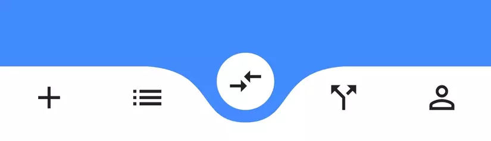
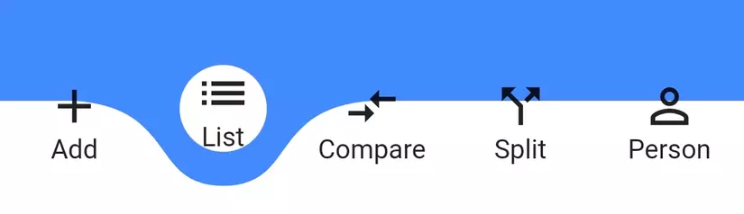
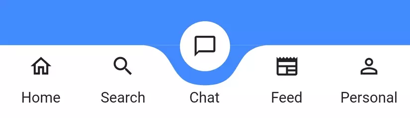
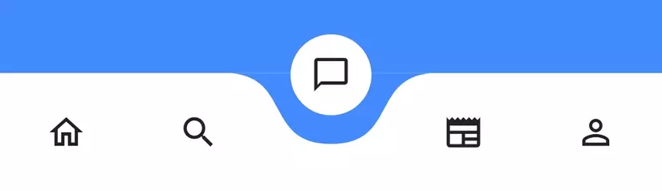

# Searching for a Satisfying Bottom Navigation Bar

Recently, while working on a project at my company, I got to explore **Flutter**. It's truly a framework that helps build cross-platform mobile apps very quickly. According to some benchmarks, **Flutter** even has performance close to native (**Kotlin** and **Swift**), and of course, it outperforms **React Native**.

In this project, I had full control over the app's UI/UX. So, I wanted to improve the Bottom Navigation Bar, making it more colorful instead of using Flutter's default Bottom Navigation Bar. After some Googling, I found the [curved_navigation_bar](https://pub.dev/packages/curved_navigation_bar) package, but it only allows displaying icons in the Bottom Navigation Bar items like this:



<br>

Example code:

```dart
bottomNavigationBar: CurvedNavigationBar(
  items: <Widget>[
    Icon(Icons.add, size: 30),
    Icon(Icons.list, size: 30),
    Icon(Icons.compare_arrows, size: 30),
    Icon(Icons.call_split, size: 30),
    Icon(Icons.perm_identity, size: 30),
  ],
)
```

<br>

If I wanted to add a label for each item, I could only do so by changing each item to a `Column` widget:

```dart
bottomNavigationBar: CurvedNavigationBar(
  items: <Widget>[
    Column(
      children: [Icon(Icons.add, size: 30), Text("Add")],
    ),
    Column(
      children: [Icon(Icons.list, size: 30), Text("List")],
    ),
    Column(
      children: [Icon(Icons.compare_arrows, size: 30), Text("Compare")],
    ),
    Column(
      children: [Icon(Icons.call_split, size: 30), Text("Split")],
    ),
    Column(
      children: [Icon(Icons.perm_identity, size: 30), Text("Person")],
    ),
  ],
)
 ```

 <br>

And the result looks like this:



It doesn't look very nice, does it? 🤔

I wanted the label of the selected item to appear below the white background area, and when I select another Bottom Navigation Bar item, the label should stay there. So, the only way was to customize this package. That's when we move to step 2 of this article.

# Custom Curved Navigation Bar

I decided to create a new, more flexible package that can support both types: items with labels and items without labels.

Tadaa... Here is my package: [curved_labeled_navigation_bar](https://pub.dev/packages/curved_labeled_navigation_bar)

Below, I'll show you how to implement both types.

## Navigation Bar with label

I created a new Widget called `CurvedNavigationBarItem` to wrap both the Icon and the label.

Example code:

```dart
bottomNavigationBar: CurvedNavigationBar(
    items: [
      CurvedNavigationBarItem(
        child: Icon(Icons.home_outlined),
        label: 'Home',
      ),
      CurvedNavigationBarItem(
        child: Icon(Icons.search),
        label: 'Search',
      ),
      CurvedNavigationBarItem(
        child: Icon(Icons.chat_bubble_outline),
        label: 'Chat',
      ),
      CurvedNavigationBarItem(
        child: Icon(Icons.newspaper),
        label: 'Feed',
      ),
      CurvedNavigationBarItem(
        child: Icon(Icons.perm_identity),
        label: 'Personal',
      ),
    ],
)
```

<br>

UI demo:

<br>



## Navigation Bar without label

Example code:

```dart
bottomNavigationBar: CurvedNavigationBar(
    items: [
      CurvedNavigationBarItem(
        child: Icon(Icons.home_outlined),
      ),
      CurvedNavigationBarItem(
        child: Icon(Icons.search),
      ),
      CurvedNavigationBarItem(
        child: Icon(Icons.chat_bubble_outline),
      ),
      CurvedNavigationBarItem(
        child: Icon(Icons.newspaper),
      ),
      CurvedNavigationBarItem(
        child: Icon(Icons.perm_identity),
      ),
    ],
)
```

<br>

UI demo:

<br>



# Conclusion

I hope this little package of mine is helpful for those who want a unique Bottom Navigation Bar. You can support me by giving a like or sharing. If you have any ideas for improvements, don't hesitate to share them with me.

* Package link: https://pub.dev/packages/curved_labeled_navigation_bar
* GitHub: https://github.com/namanh11611/curved_labeled_navigation_bar

Thank you very much!
