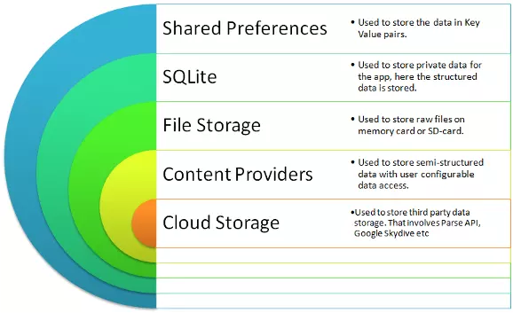
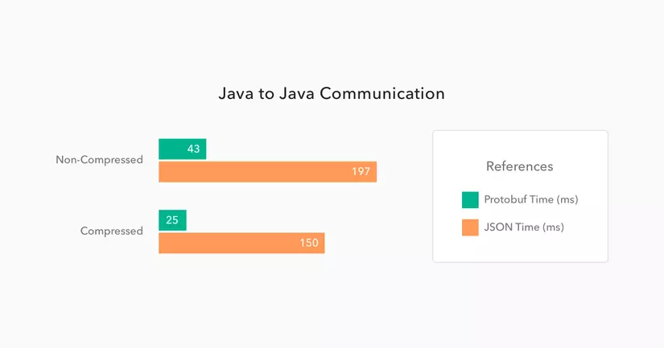
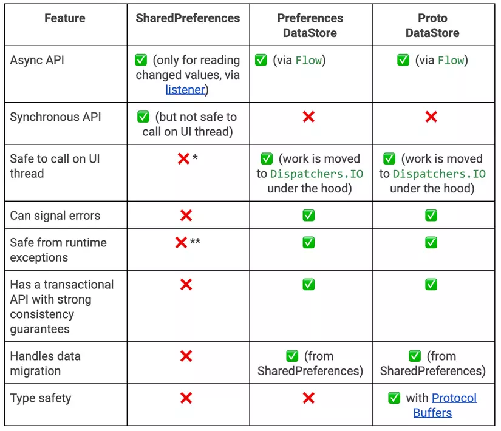

# Concept

First, we need to understand the purpose of **DataStore**.

Currently, in Android apps, there are 5 ways to store data, with **SharedPreferences** being the simplest for storing data. It only consists of **key** and **value**, where the value can be an integer, string, etc.



When the app is opened for the first time, it reads all values from the SharedPreferences XML file and loads them into RAM. This file reading process happens on the **UI Thread**. If there are too many values and the task takes more than 5 seconds, it will cause an **ANR** (Application Not Responding) error.

And **DataStore** was created to replace **SharedPreferences**.

> DataStore is a solution for storing data as **key-value pairs** or **typed objects with protocol buffers**.

Of course, DataStore is still only for storing simple structured data. It uses Coroutines and Flow to store data asynchronously and consistently.

DataStore has 2 types: **Preferences DataStore** and **Proto DataStore**. Let's look at the comparison table:

| Preferences DataStore                  | Proto DataStore                                        |
|----------------------------------------|--------------------------------------------------------|
| Store and access data by key           | Store instances of a custom data type                  |
| No need to define data type in advance | Must define data type in advance with protocol buffers |
| No type safety                         | Has type safety                                        |

# Preferences DataStore

## Create

To use Preferences DataStore, we need to create an instance of `DataStore<Preferences>` using a [property delegate](../design-pattern-delegation) with the `preferencesDataStore` keyword.

```kotlin
// At the top level of your kotlin file
val Context.dataStore: DataStore<Preferences>
        by preferencesDataStore(name = "settings")
```

## Read

First, there are 7 functions corresponding to 7 data types:

* `intPreferencesKey()`
* `longPreferencesKey()`
* `doublePreferencesKey()`
* `floatPreferencesKey()`
* `booleanPreferencesKey()`
* `stringPreferencesKey()`
* `stringSetPreferencesKey()`

When reading data, use the function corresponding to the value you want to store. For example, to store a `counter` variable as an integer to count how many times the user opens the app:

```kotlin
val OPEN_APP_COUNTER = intPreferencesKey("open_app_counter")
val openAppCounterFlow: Flow<Int> = context.dataStore.data
   	.map { preferences ->
    	// No type safety.
    	preferences[OPEN_APP_COUNTER] ?: 0
    }
```

The difference from SharedPreferences is that here, data is returned as a Flow. Now, upper layers like Repository can observe data consistently, regardless of whether it comes from DataStore, Room database, or Server, because everything is returned as a Flow.

## Write

To write data, use the `edit` function, which is quite similar to SharedPreferences.

```kotlin
context.dataStore.edit { settings ->
    val openAppCounterValue = settings[OPEN_APP_COUNTER] ?: 0
    settings[OPEN_APP_COUNTER] = openAppCounterValue + 1
}
```

# Proto DataStore

Before learning about Proto DataStore, let's take a look at protocol buffers.

## Protocol buffers

This is a data format that is independent of programming language or platform. It's like JSON but much smaller and faster. Protocol buffers are also said to be the most widely used data format at Google.

* Used to store compact data
* Fast parsing
* Supports many programming languages like C++, C#, Dart, Go, Java, Kotlin, Python
* Optimizes functionality through auto-generated classes

For example, a `message` about user info with name, id, and email:

```protobuf
message UserProfile {
  optional string name = 1;
  optional int32 id = 2;
  optional string email = 3;
}
```

To compare the performance of Protocol buffers and JSON, let's make 500 `GET` requests from one Spring Boot app to another, with and without data compression. Here are the results:



We can see Protocol buffer is **5 to 6 times faster** than JSON.

## Create

To use Proto DataStore, you must define the data type with a proto file `settings.pb` in the folder `app/src/main/proto/` like this:

```protobuf
syntax = "proto3";
option java_package = "com.example.application";
option java_multiple_files = true;
message Settings {
  	int32 open_app_counter = 1;
}
```

Next, declare an object implementing the `Serializer<T>` class, where `T` is the data type defined in the proto file.

```kotlin
object SettingsSerializer : Serializer<Settings> {
  override val defaultValue: Settings = Settings.getDefaultInstance()

  override suspend fun readFrom(input: InputStream): Settings {
    try {
      return Settings.parseFrom(input)
    } catch (exception: InvalidProtocolBufferException) {
      throw CorruptionException("Cannot read proto.", exception)
    }
  }

  override suspend fun writeTo(
    t: Settings,
    output: OutputStream
  ) = t.writeTo(output)
}
```

Finally, use the [property delegate](../design-pattern-delegation) with the `dataStore` keyword to create an instance of `DataStore<T>`.

```kotlin
val Context.settingsDataStore: DataStore<Settings> by dataStore(
  fileName = "settings.pb",
  serializer = SettingsSerializer
)
```

## Read

Similar to Preferences DataStore, use `DataStore.data` to return a Flow.

```kotlin
val openAppCounterFlow: Flow<Int> = context.settingDataStore.data
  .map { settings ->
    // The openAppCounter is generated from the proto schema.
    settings.openAppCounter
  }
```

## Write

To write data to Proto DataStore, use the `updateData()` function.

```kotlin
context.settingsDataStore.updateData { currentSettings ->
  currentSettings.toBuilder()
    .setExampleCounter(currentSettings.exampleCounter + 1)
    .build()
}
```

# Comparison with SharedPreferences



## Migrate from SharedPreferences to Preferences DataStore

To migrate, pass `SharedPreferencesMigration` to the `produceMigrations` parameter. DataStore will automatically migrate for you.

```kotlin
val Context.dataStore: DataStore<Preferences> by preferencesDataStore(
  name = DATA_STORE_NAME
  produceMigrations = { context ->
    listOf(SharedPreferencesMigration(
      context,
      SHARED_PREFERENCES_NAME
    ))
  }
)
```

## Migrate from SharedPreferences to Proto DataStore

First, declare `UserProfile` and `UserProfileSerializer` as above. Then write a mapping function to migrate from key-value pairs in SharedPreferences to the data type in Proto DataStore.

```kotlin
val Context.dataStore: DataStore<UserProfile> by dataStore(
  fileName = "settings.pb",
  serializer = UserProfileSerializer,
  produceMigrations = { context ->
    listOf(
      SharedPreferencesMigration(
        context,
        "settings_pref"
      ) { prefs: SharedPreferencesView, user: UserProfile ->
        user.toBuilder()
            .setName(prefs.getString(NAME_KEY))
            .setId(prefs.getInt(ID_KEY))
            .setEmail(prefs.getString(EMAIL_KEY))
            .build()
      }
    )
  }
)
```

# References

* https://developer.android.com/topic/libraries/architecture/datastore
* https://protobuf.dev/programming-guides/proto3
* https://android-developers.googleblog.com/2020/09/prefer-storing-data-with-jetpack.html
* https://stackoverflow.com/questions/9986734/which-android-data-storage-technique-to-use
* https://auth0.com/blog/beating-json-performance-with-protobuf
* https://proandroiddev.com/is-jetpack-datastore-a-replacement-for-sharedpreferences-efe92d02fcb3
* https://kinya.hashnode.dev/migrating-sharedpreferences-to-datastore-ckxzlvda101by8rs1c8bg4wdx
* https://amitshekhar.me/blog/jetpack-datastore-preferences
