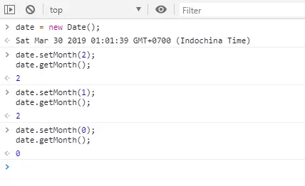
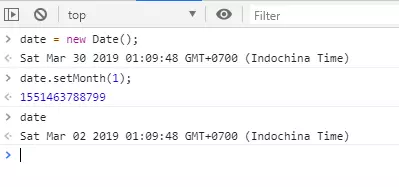

# The Unfortunate Situation

JavaScript developers are surely familiar with `Date`, the object used to calculate days, months, and years. On a beautiful day, March 29, 2019, while happily and enthusiastically working overtime, I suddenly discovered a bug related to date display on the Front-end. Wait, when I pass **1** as a parameter, it returns **Mar** (March), passing **0** returns **Jan** (January), but what I wanted was **Feb** (February). What's going on???

I calmly opened F12 and debugged, only to find that the `Date.getMonth()` function returns such a weird result.

It was already 9pm, and I didn't trust my alertness anymore, so I switched to the Console tab to try it out. Maybe someone had customized the `getMonth()` function in the project?

And the result was as follows (reproduced on the morning of March 30):



You can try this in your own console to verify:

```javascript
var date = new Date();
date.setMonth(1);
date.getMonth();
date.setMonth(0);
date.getMonth();
```

# This Mouse Trap is Huge

It turns out that after calling `setMonth(1)`, `date` is not set to February (index = 1), but is just moved back 28 days (from March 30 to March 2).



You can read more about the `setMonth()` function [here](https://developer.mozilla.org/en-US/docs/Web/JavaScript/Reference/Global_Objects/Date/setMonth).

Reading the [Description](https://developer.mozilla.org/en-US/docs/Web/JavaScript/Reference/Global_Objects/Date/setMonth#Description) carefully, we see that `setMonth()` uses the current day of the old month to set the day for the new month. If it exceeds the number of days in the new month, it rolls over to the next month. For example, if the current day is 30 or 31, `setMonth(1)` will definitely move to March, because February has at most 29 days. Here, our current date is March 30, so when setting to February 2019 (which has 28 days), it adds 2 days and becomes March 2.

Indeed, this mouse trap has at least caught one fat mouse—me.

# Solution

From this, we learn that to use `setMonth()` and `getMonth()` comfortably, it's best to use the 1st day of the month.

```javascript
var date = new Date('March 1, 2019 00:00:01');
```

Then you can freely use `setMonth()` and `getMonth()` as you wish.

Hope you always read the documentation carefully and write fewer bugs. Don't get caught in the trap like I did.
