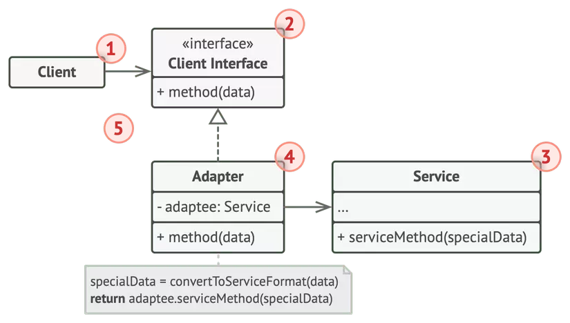
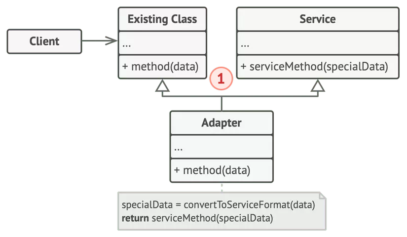

# The Problem

When you want to charge your iPhone with a type C cable => use an Adapter with a type C port and a lightning connector.

When you have data in XML format but want to use a third-party library function that only accepts JSON => use an Adapter to convert XML to JSON.

In Android, if you have a list of items and want to display them in a `RecyclerView` => use an Adapter to convert data into each `item_view`.

# Concept

The Adapter pattern allows the **interface** of an **existing class** to be used as another **interface**. It helps the **existing class** work with others **without changing its source code**.

Still sounds a bit abstract, right? Let's break it down step by step.

There are two ways to use adapters: **Object Adapter** and **Class Adapter**. Let's look at each in detail.

# Object Adapter Pattern

## Class Diagram



We implement the interface by delegating to the **adaptee** object at run-time.

Let me explain a bit more:

1. **Client** is the existing class mentioned in the concept.
2. **Client Interface** is now the parent interface of **Client**. Others wanting to interact with **Client** must follow this parent interface.
3. **Service** is a third-party class that only accepts JSON, as in the problem statement.
4. **Adapter** implements the **Client Interface** and contains an instance of the **Service** class (object adaptee). Whenever a method of **Adapter** is called, it calls the corresponding method of **Service**.
5. This way, we can work with **Service** without modifying **Client**'s code.

## Code sample

```java
// Client Interface
interface TypeCPhone {
    void chargeByTypeC();
}

// Service Interface
interface LightningPhone {
    void chargeByLightning();
}

// Service
class IPhone implements LightningPhone {
    @Override
    public void chargeByLightning() {}
}

// Adapter
class TypeCToLightningPhoneAdapter implements TypeCPhone {
    private LightningPhone lightningPhone;
    
    public TypeCToLightningPhoneAdapter(LightningPhone lightningPhone) {
        this.lightningPhone = lightningPhone;
    }
    
    @Override
    public void chargeByTypeC() {
        lightningPhone.chargeByLightning();
    }
}

public class Demo {
    static void chargeMyXiaomiPhone(TypeCPhone phone) {
        phone.chargeByTypeC();
    }
    
    public static void main(String[] args) {
        IPhone iPhone = new IPhone();
        TypeCToLightningPhoneAdapter adapter = new TypeCToLightningPhoneAdapter(iPhone);
        chargeMyXiaomiPhone(adapter);
    }
}
```

# Class Adapter pattern



The Class Adapter doesn't need to wrap any object because it inherits from both **Client** and **Service**.

Unfortunately, Java doesn't support multiple inheritance, so we don't have a Java code sample for this part.

# Conclusion

**Adapter** is a fairly familiar design pattern. Through the explanation and a bit of sample code, I hope everyone understands it better.

**Reference**

- https://en.wikipedia.org/wiki/Adapter_pattern
- https://refactoring.guru/design-patterns/adapter
