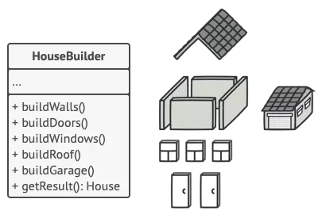

*Photo by [Frames For Your Heart](https://unsplash.com/@framesforyourheart?utm_content=creditCopyText&utm_medium=referral&utm_source=unsplash) on [Unsplash](https://unsplash.com/photos/yellow-crane-near-building-during-daytime-VoI2jd75M6Q?utm_content=creditCopyText&utm_medium=referral&utm_source=unsplash)*

In the programming world, **Builder Pattern** is known as one of the popular design patterns in the **Creational Pattern** group, helping to create complex objects in a flexible and readable way. You may have encountered it in your code but not noticed. In older programming languages, implementing the **Builder Pattern** could be lengthy and complicated, but newer languages have made it much easier. Today, let's explore the journey of Builder Pattern from **60 lines of Java code** to just **1 line in Kotlin**.

# What is the Builder Pattern?

In software development, there are many classes that need to be initialized with various properties. For example, a `House` class might have properties like `wall`, `door`, `window`, `roof`, `garage`...

Normally, to initialize an instance of this class, you might write:

```java
House myHouse = new House(4, 2, 4, 1, 1);
```

Reading this code, you might wonder what `4` and `2` mean. If you use a regular constructor or setters for each property, you may encounter issues like:

* **Hard to read and easy to confuse**: Calling a constructor with many parameters without knowing their meaning can be confusing.
* **Prone to errors**: If the order of parameters is wrong, the compiler may not catch it if the parameters have the same type.
* **Lack of flexibility**: If some properties are optional, you'll need many overloaded constructors or setters, making the code messy.
* **Risk of creating objects in an invalid state**: If not all necessary setters are called, the object may lack required data.

That's why the **Builder Pattern** was created to solve these problems by moving the code for initializing properties out of the class and into another class called the **Builder**. You can see the illustration below:



Separating the code into `HouseBuilder` allows you to create objects step by step, clearly and flexibly. You can choose which properties to set and which to skip.

Let's look at the implementation in **Java** next.

# Java: Full Builder Pattern

Leaving houses aside, let's look at another classic example: the `User` class.

```java
public class User {
    private final String name;
    private final int age;
    private final String address;
    private final boolean isVerified;
    private final boolean isDeleted;

    private User(Builder builder) {
        this.name = builder.name;
        this.age = builder.age;
        this.address = builder.address;
        this.isVerified = builder.isVerified;
        this.isDeleted = builder.isDeleted;
    }

    public static class Builder {
        private String name;
        private int age;
        private String address;
        private boolean isVerified;
        private boolean isDeleted;

        public Builder setName(String name) {
            this.name = name;
            return this;
        }

        public Builder setAge(int age) {
            this.age = age;
            return this;
        }

        public Builder setAddress(String address) {
            this.address = address;
            return this;
        }

        public Builder setVerified(boolean verified) {
            this.isVerified = verified;
            return this;
        }

        public Builder setDeleted(boolean deleted) {
            this.isDeleted = deleted;
            return this;
        }

        public User build() {
            return new User(this);
        }
    }
}

User user = new User.Builder()
    .setName("Henry Techie")
    .setAge(30)
    .setAddress("Hanoi")
    .setVerified(true)
    .setDeleted(false)
    .build();
```

As you can see, it takes **60 lines of code** to set up the **Builder Design Pattern** in Java. For classes with more properties, the boilerplate code increases.

# Simplified in Kotlin

With **Kotlin** and other modern languages (**Python**, **Swift**, **Dart**...), things are simplified thanks to **Named Arguments**.

Kotlin natively supports **named arguments** and **default values**, so you don't need to implement the **Builder Pattern** manually:

```kotlin
data class User(
    val name: String,
    val age: Int,
    val address: String = "",
    val isVerified: Boolean = false,
    val isDeleted: Boolean = false
)

val user = User(
    name = "Henry Techie",
    age = 30,
    address = "Hanoi"
)

val user = User(
    name = "Henry Techie",
    age = 30,
    isVerified = true
)
```

Tada... No need for a builder class, no need for 60 lines of setters. Just **1 line of code** to create an object with flexible parameters. You can declare or skip `address`, `isVerified`, and `isDeleted` as you wish.

# Conclusion

From the full **Builder Pattern** in **Java** to **data class** and **named arguments** in **Kotlin**, we've witnessed a wonderful simplification. That's why I said Builder Pattern appears in every breath of our code, you just haven't noticed it yet.

Have a great weekend!
