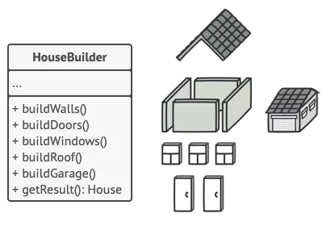

*Photo by [Frames For Your Heart](https://unsplash.com/@framesforyourheart?utm_content=creditCopyText&utm_medium=referral&utm_source=unsplash) on [Unsplash](https://unsplash.com/photos/yellow-crane-near-building-during-daytime-VoI2jd75M6Q?utm_content=creditCopyText&utm_medium=referral&utm_source=unsplash)*

Trong giới võ lâm, **Builder Pattern** được biết đến như một trong những design pattern phổ biến thuộc nhóm **Creational Pattern**, giúp tạo ra đối tượng phức tạp theo cách linh hoạt và dễ đọc hơn. Có thể nhiều bạn đã gặp nó ngay trong các dòng code xung quanh mình nhưng không để ý. Với các ngôn ngữ lập trình trước đây, cách triển khai **Builder Pattern** có thể hơi dài dòng phức tạp, nhưng mình để ý thấy những ngôn ngữ ra mắt sau này đã cải tiến nó để việc triển khai trở nên dễ như ăn kẹo. Vậy nên hôm nay, chúng ta sẽ cùng khám phá hành trình của Builder Pattern từ **60 dòng code Java** đến chỉ còn **1 dòng trong Kotlin**.

# Builder Pattern là cái chi chi?

Trong thực tế phát triển phần mềm, có rất nhiều class cần khởi tạo với nhiều thuộc tính khác nhau. Ví dụ một class `House` có thể có các thuộc tính như `wall`, `door`, `window`, `roof`, `garage`...

Thông thường, để khởi tạo một instance cho class này, chúng ta sẽ code như sau:

```java
House myHouse = new House(4, 2, 4, 1, 1);
```

Đọc đoạn code trên, đôi khi bạn sẽ tự hỏi `4` và `2` ở đây có ý nghĩa là gì? Nếu chúng ta khởi tạo bằng constructor thông thường hoặc sử dụng setter cho từng thuộc tính, sẽ dễ gặp phải một số vấn đề như:

* **Khó đọc và dễ nhầm lẫn**: việc gọi constructor với nhiều tham số mà không biết rõ ý nghĩa từng tham số sẽ gây khó hiểu.
* **Dễ gây ra lỗi**: Khi thứ tự các tham số sai, compiler có thể không bắt được nếu các tham số cùng kiểu.
* **Thiếu sự linh hoạt**: Nếu một số thuộc tính là tuỳ chọn, bạn sẽ cần nhiều constructor overload hoặc setter, gây rối code.
* **Tăng nguy cơ tạo object ở trạng thái không hợp lệ**: Nếu chưa gọi đủ setter cần thiết, object có thể không đầy đủ dữ liệu.

Chính vì vậy, **Builder Pattern** sinh ra để giúp giải quyết các vấn đề này bằng cách đưa code khởi tạo các thuộc tính ra khỏi class và chuyển nó đến một class khác gọi là **Builder**. Bạn có thể quan sát minh hoạ sau đây:



Việc tách code sang `HouseBuilder` cho phép chúng ta tạo đối tượng theo kiểu linh hoạt, rõ ràng từng bước hơn. Đồng thời, nó cũng cho phép tuỳ chọn set thuộc tính nào và bỏ qua thuộc tính nào.

Chúng ta sẽ đi đến với cách triển khai trong **Java** ngay ở phần tiếp theo.

# Java: Builder Pattern đầy đủ

Bỏ qua việc nhà cửa trong phần trước, mình sẽ đến với một ví dụ kinh điển khác là class `User`.

```java
public class User {
    private final String name;
    private final int age;
    private final String address;
    private final boolean isVerified;
    private final boolean isDeleted;

    private User(Builder builder) {
        this.name = builder.name;
        this.age = builder.age;
        this.address = builder.address;
        this.isVerified = builder.isVerified;
        this.isDeleted = builder.isDeleted;
    }

    public static class Builder {
        private String name;
        private int age;
        private String address;
        private boolean isVerified;
        private boolean isDeleted;

        public Builder setName(String name) {
            this.name = name;
            return this;
        }

        public Builder setAge(int age) {
            this.age = age;
            return this;
        }

        public Builder setAddress(String address) {
            this.address = address;
            return this;
        }

        public Builder setVerified(boolean verified) {
            this.isVerified = verified;
            return this;
        }

        public Builder setDeleted(boolean deleted) {
            this.isDeleted = deleted;
            return this;
        }

        public User build() {
            return new User(this);
        }
    }
}

User user = new User.Builder()
    .setName("Henry Techie")
    .setAge(30)
    .setAddress("Hanoi")
    .setVerified(true)
    .setDeleted(false)
    .build();
```

Như các bạn có thể thấy, chúng ta mất đến **60 dòng code** để setup xong **Builder Design Pattern** trong Java. Với những class có nhiều thuộc tính hơn, lượng boilerplate code còn nhiều hơn nữa.

# Đơn giản hoá trong Kotlin

Với **Kotlin** nói riêng và các ngôn ngữ mới nói chung (**Python**, **Swift**, **Dart**...), mọi việc đã được đơn giản hoá nhờ **Named Arguments**.

Kotlin hỗ trợ mặc định **named arguments** và **default values**, giúp bạn không cần implement **Builder Pattern** một cách thủ công:

```kotlin
data class User(
    val name: String,
    val age: Int,
    val address: String = "",
    val isVerified: Boolean = false,
    val isDeleted: Boolean = false
)

val user = User(
    name = "Henry Techie",
    age = 30,
    address = 'Hanoi'
)

val user = User(
    name = "Henry Techie",
    age = 30,
    isVerified = true
)
```

Tada... Không cần builder class, không cần 60 dòng setter. Chỉ cần **1 dòng code** là có object với các tham số linh hoạt. Bạn hoàn toàn có thể khai báo hoặc bỏ qua các thuộc tính `address`, `isVerified` và `isDeleted`.

# Lời kết

Từ **Builder Pattern** đầy đủ trong **Java** tới **data class** và **named arguments** trong **Kotlin**, chúng ta đã chứng kiến sự tinh giản hoá tuyệt vời. Chính vì vậy mà ban đầu mình đã nói Builder Pattern xuất hiện ngay trong từng hơi thở của chúng ta khi viết code, chỉ là bạn chưa để ý mà thôi.

Chúc các bạn ngày cuối tuần vui vẻ!
