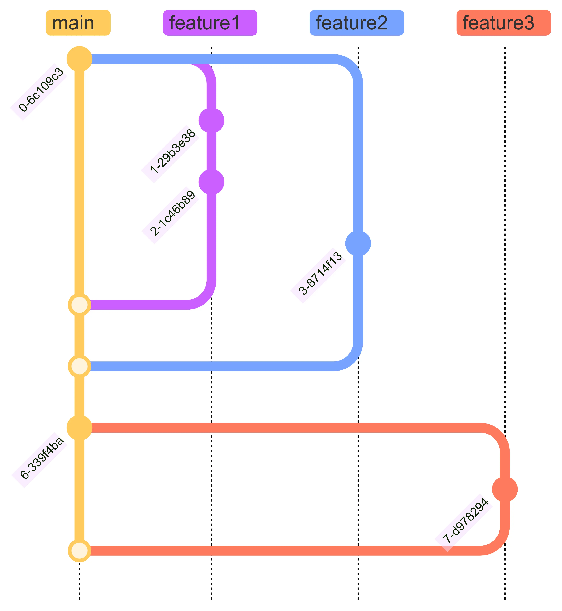
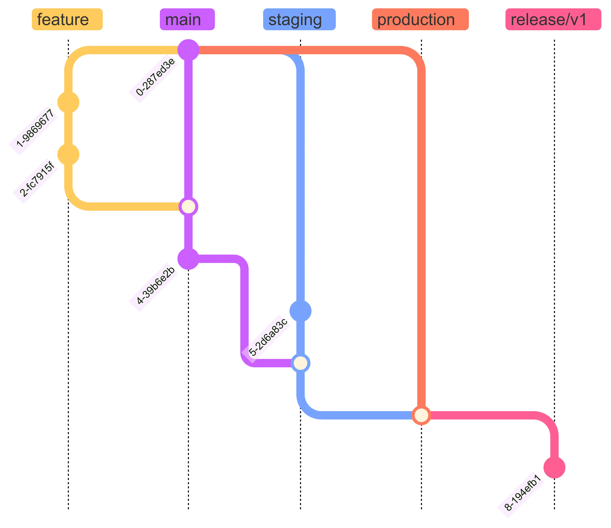

*Photo by [Felix Mittermeier](https://unsplash.com/@felix_mittermeier?utm_content=creditCopyText&utm_medium=referral&utm_source=unsplash) on [Unsplash](https://unsplash.com/photos/pieces-dechecs-sur-lechiquier-nAjil1z3eLk?utm_content=creditCopyText&utm_medium=referral&utm_source=unsplash)*

**Git Branching Strategy** refers to the way we **create branches**, **merge branches**, and decide which branches are used for releases.

When starting a project, beyond setting up the environment and building a solid codebase, selecting the right **Git Branching Strategy** is crucial. A wrong choice can lead to significant challenges. The right strategy helps the team **manage and maintain source code effectively**, **reduce conflict resolution time**, and ensure **production code remains stable**.

Over time, various strategies have emerged. This article explores some popular **Git Branching Strategies** like **Gitflow**, **GitHub Flow**, **GitLab Flow**, and **Trunk-Based Development**. Finally, we’ll discuss how to choose the right strategy for your project.

# Gitflow

[**Gitflow**](https://nvie.com/posts/a-successful-git-branching-model), introduced by [**Vincent Driessen**](https://nvie.com/about), is well-suited for projects with clear and complex release cycles. **Gitflow** uses multiple branch types to manage the development and release phases.

In this flow, there are two main branches: **master** and **develop**. The **master** branch contains stable code ready for release, while **develop** contains the latest changes for the next release. It’s the main branch for feature integration.

Additionally, there are **feature** branches that are `checkout` from **develop** and used to develop new features. Once completed, they are `merge` back into **develop**.

When ready for release, a branch is checked out from **develop** to a **release** branch with the corresponding version to prepare for the release. Bug fixes can be added as commits on this branch. Once finalized, the **release** branch is `merge` into both **master** and **develop** to keep the two main branches updated.

Finally, there are **hotfix** branches. When production code encounters a critical bug that needs an immediate fix, a **hotfix** branch is `checkout` from **master** for the fix. Similar to **release** branches, **hotfix** branches must also be `merge` into both **master** and **develop**.

## Advantages

- Provides a clear structure, ideal for large projects.
- Efficiently manages development and release phases with versioned **release** branches.
- **Hotfix** branches allow quick fixes without disrupting ongoing development.

## Disadvantages

- Complex and requires multiple branches and merges. For example, each **release** or **hotfix** branch needs to be merged into both **master** and **develop**.
- Unsuitable for projects requiring **CI/CD**.
- Challenging for small teams due to its cumbersome nature.

# GitHub Flow

[**GitHub Flow**](https://docs.github.com/en/get-started/using-github/github-flow) is a lightweight, simple strategy ideal for **CI/CD** and commonly used in open-source projects or small teams.

Unlike Gitflow, it has a single main branch, **main**, which contains thoroughly tested and stable code ready for production.

Features are developed in **feature** branches, tested, reviewed, and merged into **main** via pull requests.

## Advantages

- Simple and easy to understand, making it quick to implement.
- Perfect for **CI/CD** workflows, ensuring the **main** branch is always deployable.
- Fewer branches mean reduced conflicts and merge errors.

## Disadvantages

- Lacks the structure of Gitflow.
- Unsuitable for large projects or those requiring support for multiple versions.
- Does not define clear processes for releases or bug fixes.

# GitLab Flow

[**GitLab Flow**](https://about.gitlab.com/topics/version-control/what-is-gitlab-flow) combines elements of Gitflow and GitHub Flow. It introduces **environment branches** like **staging** and **production**, making it suitable for **CI/CD** and tightly integrated with GitLab’s **CI/CD** tools.

Similar to GitHub Flow, GitLab Flow works directly with the primary branch, **main**, which contains stable source code ready for release. This flow also includes feature branches for developing new features.

When the code on the **main** branch is ready for testing, we `merge` it into the **staging** branch. After testing and confirming it is ready for deployment, we `merge` the code from the **staging** branch into the **production** branch. GitLab Flow often uses **release** branches, such as **release/v1** and **release/v2**, to independently manage and deploy different versions of the application.

However, when there is a bug in production, you need to merge the code into the **main** branch first, then `merge` or `cherry-pick` it into other branches following the above process.

## Advantages

- Simpler than Gitflow, but more structured than GitHub Flow.
- Well-suited for **CI/CD** projects with multiple environments.
- Supports independent management of different application versions using **release** branches.

## Disadvantages

- Best suited for GitLab and its **CI/CD** tools.
- Requires careful setup to leverage its full potential.
- Not ideal for projects without **CI/CD** requirements.

# Trunk-Based Development

For a detailed discussion, refer to my article: [Trunk-Based Development - A Git Workflow to Reduce Merge Conflicts](../trunk-based-development). **Trunk-Based Development (TBD)** is a strategy where all developers work on a single main branch, typically **main**. Changes are continuously and quickly committed to this branch, minimizing the lifespan of feature branches.

## Advantages

- Encourages **CI** and minimizes merge conflicts.
- Ideal for Agile and DevOps projects requiring **CD**.
- Easy to manage and track the codebase.

## Disadvantages

- Higher risk of directly committing errors to the main branch.
- Requires robust code reviews and automation tests to maintain stability.
- Unsuitable for large, distributed teams.

# Choosing the Right Strategy

There’s no one-size-fits-all solution. The choice of Git branching strategy depends on factors like project scale, team structure, and development requirements. Below are some suggestions:

| Project Type | Team Size | Recommended Strategy |
| -------- | -------- | -------- |
| Small to medium projects with continuous delivery | Small, Medium | GitHub Flow, TBD |
| Scheduled and periodic releases | Medium | GitFlow, GitLab Flow |
| CI/CD projects with multiple environments | Medium, Large | GitLab Flow |
| Long-term maintenance projects | Large | GitFlow |

Each strategy has its pros and cons. The key is selecting one that aligns with your team’s workflow and project requirements. Doing so optimizes productivity and minimizes risks in source code management.

# Referrence

* https://nvie.com/posts/a-successful-git-branching-model
* https://docs.github.com/en/get-started/using-github/github-flow
* https://about.gitlab.com/topics/version-control/what-is-gitlab-flow
* https://www.gitkraken.com/learn/git/best-practices/git-branch-strategy
* https://www.geeksforgeeks.org/branching-strategies-in-git
* https://www.abtasty.com/blog/git-branching-strategies
