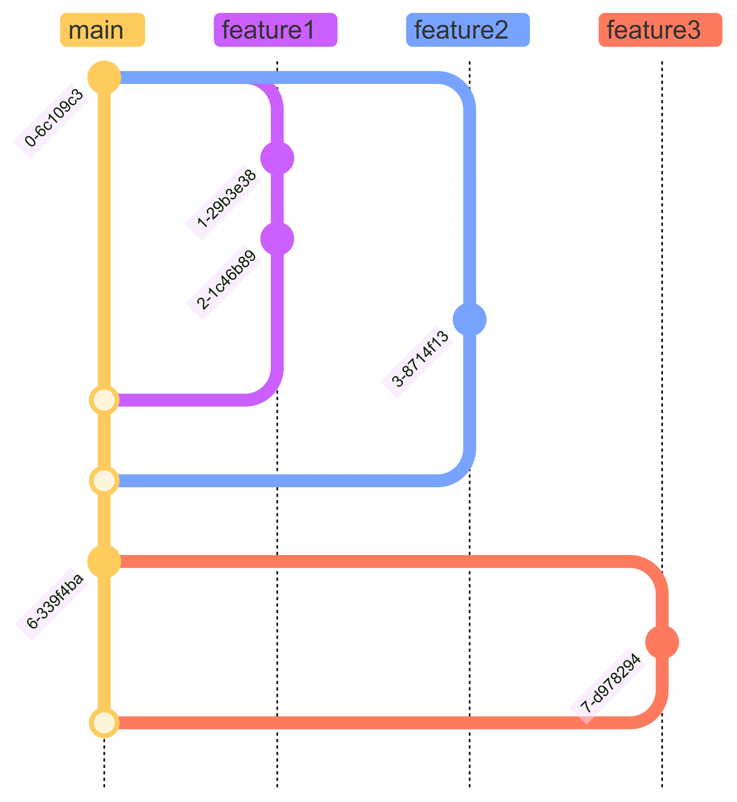
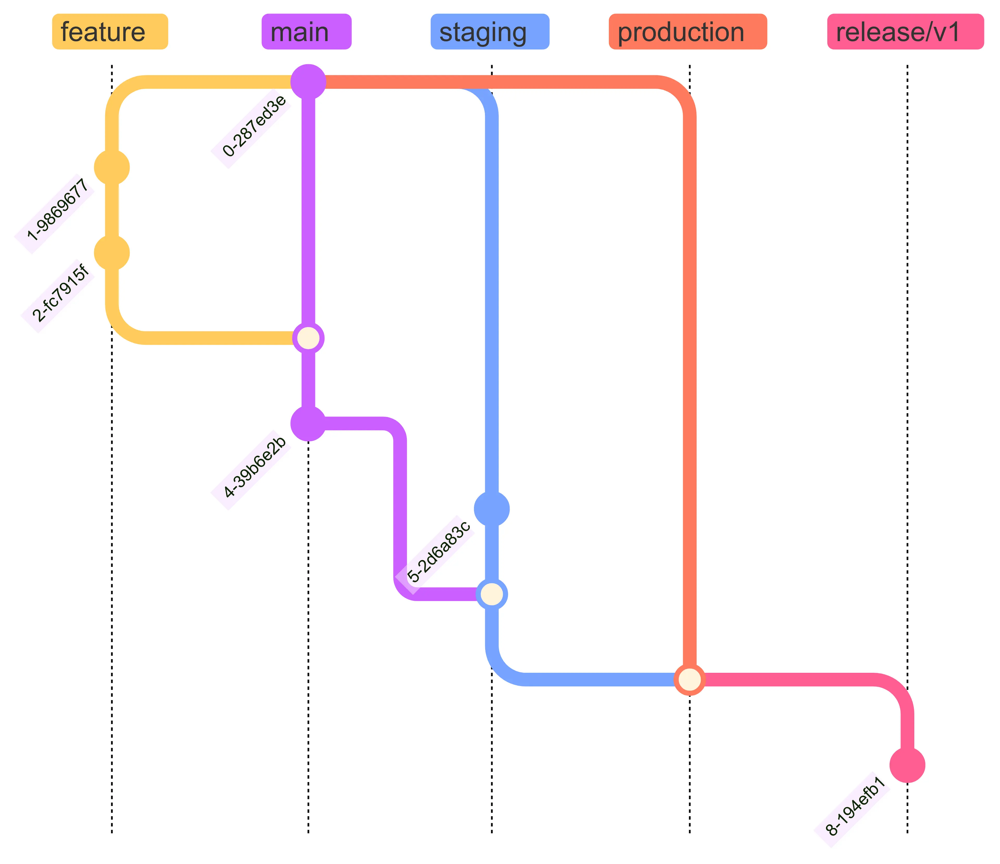

*Photo by [Felix Mittermeier](https://unsplash.com/@felix_mittermeier?utm_content=creditCopyText&utm_medium=referral&utm_source=unsplash) on [Unsplash](https://unsplash.com/photos/pieces-dechecs-sur-lechiquier-nAjil1z3eLk?utm_content=creditCopyText&utm_medium=referral&utm_source=unsplash)*

**Git Branching Strategy** dịch ra tiếng Việt là **Chiến lược làm việc với branch của Git**, nhưng nó vừa dài vừa dễ hiểu nhầm nên mình giữ nguyên cụm từ gốc để giữ gìn sự trong sáng của tiếng Anh nhé. Nó ám chỉ cách chúng ta **tạo branch**, **merge branch** nào với branch nào và dùng **branch nào để release**.

Khi bắt đầu một dự án, ngoài những việc như setup môi trường, dựng code base thật tốt... thì có lẽ việc chọn một **Git Branching Strategy** đúng đắn cũng rất quan trọng, vì chọn sai một ly là đi một dặm. Chọn chiến lược đúng giúp cả team **quản lý và duy trì source code một cách hiệu quả**, **giảm thời gian resolve conflict** và giữ cho **code trên production luôn hoạt động ổn định**.

Qua thời gian, nhiều chiến lược đã được phát triển. Trong bài viết này, chúng ta sẽ tìm hiểu về một số **Git Branching Strategy** phổ biến như **Gitflow**, **GitHub Flow**, **GitLab Flow** và **Trunk Based Development**. Cuối cùng, chúng ta sẽ xem xét cách chọn chiến lược phù hợp cho dự án của bạn.

# Gitflow

[**Gitflow**](https://nvie.com/posts/a-successful-git-branching-model) là một chiến lược phổ biến được giới thiệu bởi [**Vincent Driessen**](https://nvie.com/about). Chiến lược này phù hợp với các dự án có chu kỳ release rõ ràng và phức tạp. **Gitflow** sử dụng nhiều loại branch khác nhau để quản lý các giai đoạn phát triển và release của dự án.

Trong flow này, chúng ta có 2 branch chính là **master** và **develop**. Trong đó, **master** sẽ lưu trữ phiên bản source code ổn định và sẵn sàng release bất cứ khi nào, còn **develop** chứa source code đang được phát triển, gồm những thay đổi mới nhất cho bản release tiếp theo, đây là branch chính nơi các feature mới được tích hợp.

Ngoài ra chúng ta còn có các branch **feature** được `checkout` từ **develop** và dùng để phát triển các feature mới, sau khi hoàn thành thì `merge` ngược lại **develop**.

Khi đã sẵn sàng release, chúng ta sẽ checkout từ **develop** sang branch **release** với version tương ứng để chuẩn bị cho bản release. Chúng ta có thể thêm vài commit fix bug trên brach này. Khi hoàn thành, chúng ta lại `merge` branch **release** vào cả **master** và **develop** để giữ 2 branch chính được update.

Và cuối cùng là các branch **hotfix**, khi code trên production gặp critical bug và cần fix ngay lập tức, chúng ta sẽ `checkout` branch **hotfix** từ **master** để fix. Tương tự như branch **release**, các branch **hotfix** cũng cần `merge` vào cả **master** và **develop**.

## Ưu Điểm

* Gitflow có cấu trúc rất rõ ràng, phù hợp cho các dự án lớn.
* Nó giúp chúng ta quản lý các giai đoạn phát triển và release một cách hiệu quả với các branch **release** cho từng version.
* Các branch **hotfix** cho phép triển khai các bản fix bug nhanh chóng mà không làm gián đoạn quá trình phát triển.

## Nhược Điểm

* Như các bạn có thể thấy, flow này khá phức tạp, cần nhiều branch và merge nhiều lần. Ví dụ như mỗi branch **release** hoặc **hotfix** cần phải merge cả vào **master** và **develop**.
* Nó không phù hợp cho các dự án có yêu cầu **CI/CD**.
* Với mô hình cồng kềnh như này, Gitflow có thể khó khăn khi áp dụng trong các team nhỏ.

# GitHub Flow

[**GitHub Flow**](https://docs.github.com/en/get-started/using-github/github-flow) là một chiến lược đơn giản và nhẹ nhàng, phù hợp cho các dự án có yêu cầu **CI/CD**. Chiến lược này được sử dụng phổ biến trong các dự án open source và các team nhỏ.

Thay vì 2 branch chính như Gitflow, nó chỉ có 1 branch chính duy nhất là **main** để chứa source code ổn định và đã được test cẩn thận, sẵn sàng release production.

Các branch **feature** được `checkout` từ **main** để phát triển các feature mới. Sau khi hoàn thành dev, test và được review, chúng được merge vào **main** thông qua pull request.

## Ưu Điểm

* Qua phần giới thiệu, bạn có thể thấy GitHub Flow khá đơn giản và dễ hiểu, dễ dàng triển khai.
* Phù hợp với **CI/CD**. Code ở **main** brach luôn sẵn sàng deploy lên production.
* Giảm thiểu conflict và lỗi khi merge do có ít branch hơn.

## Nhược Điểm

* Thiếu cấu trúc và phân chia rõ ràng như Gitflow.
* Không phù hợp cho các dự án lớn, support nhiều version hoặc dự án phức tạp với nhiều team tham gia.
* Không có quy trình rõ ràng cho việc release và fix bug.

# GitLab Flow

[**GitLab Flow**](https://about.gitlab.com/topics/version-control/what-is-gitlab-flow) kết hợp các yếu tố từ cả Gitflow và GitHub Flow. Nó đơn giản hơn Gitflow và tương tự như GitHub Flow, điểm khác biệt là có thêm các environment branch, ví dụ như **staging**, **production**... Đặc biệt, nó được thiết kế để hỗ trợ cả **CI/CD**, với sự tích hợp chặt chẽ cùng các công cụ **CI/CD** của GitLab.

Tương tự như GitHub Flow, GitLab Flow làm việc trực tiếp với branch chính là **main**, nó chứa source code ổn định và có thể release. Flow này cũng có các branch **feature** để phát triển feature.

Khi code ở **main** branch đã sẵn sàng test, chúng ta sẽ `merge` nó vào **staging** branch. Sau khi test và thấy sẵn sàng deploy, chúng ta sẽ `merge` code từ **staging** vào **production** branch. GitLab Flow cũng thường sử dụng các brach **release**, ví dụ như branch **release/v1** và **release/v2** giúp quản lý và triển khai các phiên bản khác nhau của ứng dụng một cách độc lập.

Tuy nhiên, khi có bug trên production, bạn cần merge code vào brach **main** trước, sau đó mới `merge` hoặc `cherry-pick` sang các branch khác theo quy trình như trên.

## Ưu Điểm

* Khi so sánh với Gitflow, GitLab Flow trông sẽ đơn giản hơn. Còn khi so sánh với GitHub Flow, nó lại có cấu trúc rõ ràng hơn.
* Phù hợp cho các dự án cần **CI/CD** và có nhiều môi trường khác nhau, giúp dễ dàng deploy.

## Nhược Điểm

* Vì được may đo cho **GitLab** nên flow này yêu cầu sử dụng **GitLab** và các công cụ **CI/CD** của nó.
* Chúng ta cũng cần thiết lập và cấu hình cẩn thận để tận dụng hết các tính năng.
* Nó cũng không phù hợp với các dự án không có yêu cầu **CI/CD**.

# Trunk Based Development

Riêng về chiến lược này, mình đã viết một bài chi tiết: [Trunk Based Development - một Git workflow giúp giảm cơn đau đầu resolve conflict](../trunk-based-development). Dành cho bạn nào chưa biết thì **Trunk Based Development** (TBD) là một chiến lược trong đó tất cả dev làm việc trực tiếp trên một branch chính, thường là **main**. Các thay đổi được commit liên tục và nhanh chóng vào branch này, giảm thiểu thời gian sống của các branch phụ.

## Ưu Điểm

* Thúc đẩy **CI**, giảm thiểu conflict khi merge.
* Phù hợp với các dự án Agile và DevOps yêu cầu **CD**.
* Dễ dàng quản lý và theo dõi source code.

## Nhược Điểm

* Rủi ro cao hơn về việc commit lỗi trực tiếp vào branch chính.
* Cần kiểm tra source code và automation test để duy trì sự ổn định.
* Không phù hợp cho các dự án lớn với nhiều team phân tán.

# Chọn Chiến Lược Phù Hợp

Sẽ không có chiến lược nào là chính xác nhất, phù hợp với mọi hoàn cảnh. Việc chọn chiến lược branching phù hợp phụ thuộc vào nhiều yếu tố như quy mô dự án, cấu trúc team và yêu cầu về quy trình phát triển phần mềm. Dưới đây là một số gợi ý:

| Dự án | Team size | Chiến lược |
| -------- | -------- | -------- |
| Dự án nhỏ đến trung bình, cần CD và release liên tục | Nhỏ, Vừa | GitHub Flow và TBD |
| Release theo lịch trình và định kỳ | Vừa | GitFlow and GitLab Flow |
| CD với product yêu cầu chất lượng cao, nhiều môi trường release | Vừa, Lớn | GitLab Flow |
| Product với chu kỳ maintain lâu dài | Lớn | GitFlow |

Mỗi chiến lược Git branching đều có ưu và nhược điểm riêng. Quan trọng là lựa chọn chiến lược phù hợp với quy trình làm việc của team và yêu cầu dự án. Điều này sẽ giúp tối ưu hóa hiệu suất làm việc và giảm thiểu rủi ro trong quản lý source code.

# Referrence

* https://nvie.com/posts/a-successful-git-branching-model
* https://docs.github.com/en/get-started/using-github/github-flow
* https://about.gitlab.com/topics/version-control/what-is-gitlab-flow
* https://www.gitkraken.com/learn/git/best-practices/git-branch-strategy
* https://www.geeksforgeeks.org/branching-strategies-in-git
* https://www.abtasty.com/blog/git-branching-strategies
