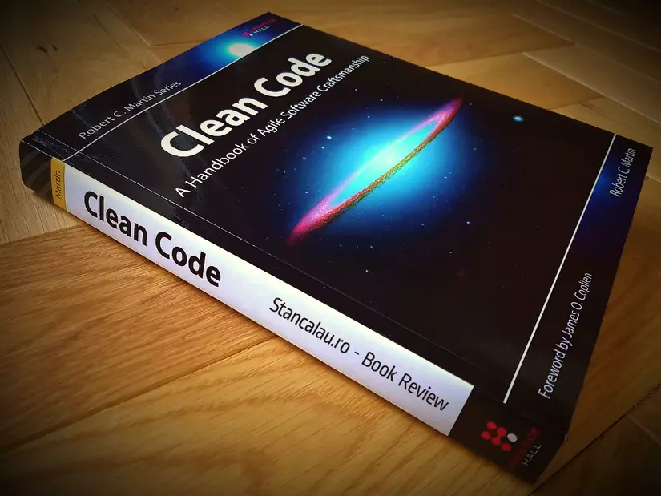

# Who am I?

Hello everyone!

I'm Nam Anh, an Android developer with 5 years of experience. During those 5 years, I've wandered through quite a few tech companies in Hanoi.

This is probably the first time I've written an article from such a personal perspective. So you might wonder: *"Who is this guy to be giving life advice?"*

Oops, I'm not here to lecture anyone, just to share things that I found true for myself. Maybe for you, they're right or wrong. But who knows, maybe some Juniors will gain a new perspective to improve their **career path**.

# The Lucky Things

There are things that, when they happened, I didn't realize were right until I looked back later and thought: *"Oh, turns out I did the right thing back then."* And I feel those were real strokes of luck for me.

## Reading Clean Code right after graduation

I have to admit, I used to love reading books and read quite a lot, all kinds of genres. But I read very few tech books, probably because my English was limited 😢😢

But the tech book I value the most is **Clean Code**. As the name suggests, it teaches you how to write *"clean code"*, a fundamental book highly recommended by many. I don't know who convinced me to read it right after graduation, but I read it and took notes summarizing the book. I still keep those notes to this day. Learning from the book, plus a bit of OCD, I think I've applied quite a bit of it to the projects I've worked on.

Some people advise reading **Clean Code** once when you **just graduate**, and again after **a few years of working**, so you can really absorb its content. So I highly, highly recommend everyone read it, whether you're a junior or a seasoned senior.

## Working at product companies with strict processes

There are already many articles comparing product and outsourcing companies, so I won't repeat that. I've worked at both types. In this article, I just want to mention **code review processes** and **product mindset**.

From my experience, big product companies have **more time for thorough code reviews**, not as rushed by deadlines as outsourcing companies. I'm only talking about big product companies, because I've also worked at small startups where the only goal was to get the code running, clean or dirty didn't matter.

The knowledge I learned from **Clean Code** was just theory until I joined big product companies and had seniors carefully review my code. That's when I really matured in every line I wrote.

Another thing I learned is the **product mindset**—always thinking about the product, wanting it to be better and have more users. When I had an idea for a feature, I was ready to propose it to the leader or Product Manager. The feeling when you finish a feature and see users leaving positive comments on the App Store or Play Store is amazing 😍😍

## Daring to step out of my comfort zone

In 5 years, I've switched jobs many times like many others. I don't know about you, but I fear staying at one company too long, getting too comfortable, and then struggling to catch up with the market's demands when I want to switch.

So moving through many companies helped me adapt to different projects, understand what the market needs, and of course, get a better income.

# Things I Wish I Knew Sooner

## Stay at a company long enough

Contrary to what I said above, here I want to advise young people to stay at a company long enough. In my opinion, at least 1-2 years. It gives you enough time to **understand the project** and **be properly recognized**.

Usually, when you join a project, it takes a few months to understand it. For complex projects, it can take years. **Understanding** here means not just the **technologies used** in the source code, but also the **business domain**, how your app makes money, or even its competitive advantage over others. Some seniors, even when switching companies, only work in banking or fintech, for example. So besides technical skills, they're valued for their business domain knowledge.

Companies often give out **Best Employee** awards at Year End Parties, but to be recognized, you have to stay long enough to make an impact. It's rare for a company to give such an award to someone who just finished their probation, unless you're a superstar. Achieving these things proves your ability and makes your profile shine.

There were times I only stayed at a company for a few months before leaving, and I felt that was a bit of a waste.

## Take English seriously, sooner

Everyone knows how important English is for a developer's career. If you can communicate well in English, you have more options: working for foreign companies in Vietnam, working remotely from home, or even going abroad. And a dev with good English communication skills will definitely earn more than one who can only read and understand.

I graduated with a **TOEIC 460**—just enough for basic reading. In recent years, I've started learning English seriously, and now I can communicate well with foreign colleagues. This has brought me many new opportunities.

I swear this post isn't an ad for the **Elsa** app, but it's really good so I'm recommending it. Here's my 88-day learning streak (I missed a day before and lost my streak 🥲).

My English still isn't great, so I'm learning every day. I've tried several apps—Duolingo, Memrise, Cake... and now I use Elsa along with others. But Elsa has helped me improve the most.

## The difference comes after 8pm

There are two devs, A and B, working at the same company from 8am to 6pm. So what makes the difference between them?

It comes after 8pm. Dev A spends that time **learning new technologies**, working on **pet projects**, or **contributing to open source projects**. Dev B spends it playing games or drinking. Maybe in the first few years, the difference isn't clear, but after 3 or 5 years, the gap in knowledge and skills will be huge.

Work at the company is sometimes easy, so you can only learn harder things or new technologies in your free time. For example, if your job is just UI work, you won't need to understand systems or memory deeply. If you don't spend time learning, how can you stand out from your colleagues?

In my early years, I also spent a lot of time drinking. I can't deny the importance of building relationships through those gatherings. But if I could choose again, I'd spend more time at home learning.

# Final Words

On my journey, there were times I made **the right decisions**, but also plenty of times I **chose wrong**. But the important thing is I **don't regret** or dwell on the past—I keep **learning and moving forward**. I think that's enough.

Thank you for taking the time to read my article!
