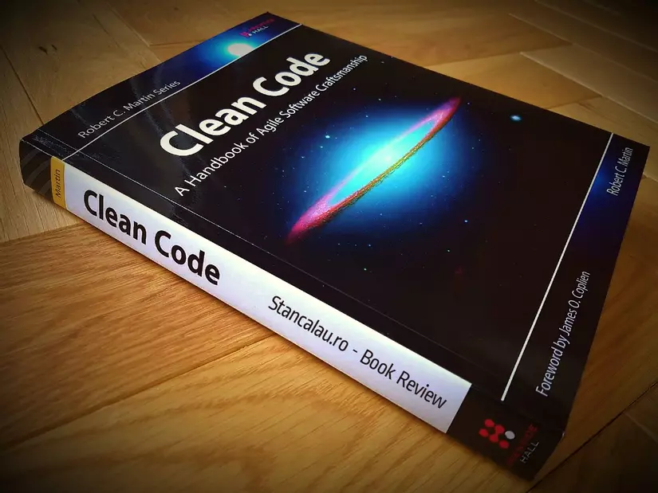
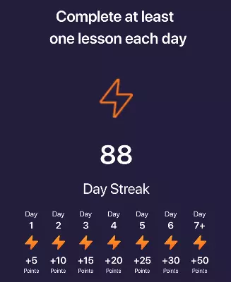

# Who am I?

Chào các bạn!

Mình là Nam Anh, Android developer với 5 năm kinh nghiệm. Trong 5 năm sự nghiệp ấy, mình đã kịp lang thang qua cũng kha khá công ty công nghệ ở Hà Nội này.

Đây có lẽ là lần đầu tiên mình viết một bài mang đậm góc nhìn cá nhân. Vậy nên có thể sẽ có bạn thắc mắc: *"Ông này là ai mà lên bài dạy đời vậy ta?"*.

Ấy chết, mình không dạy đời ai đâu, mình chỉ chia sẻ lại những điều mà mình thấy đúng với mình. Có thể với các bạn, nó đúng hoặc sai. Nhưng biết đâu, các bạn Junior sẽ có thêm một góc nhìn để cải thiện **career path** của mình.

# Những điều may mắn

Có những chuyện, lúc nó xảy ra thì mình không nghĩ là nó đúng đắn, chỉ đến khi sau này ngồi nhìn lại, mình mới chợt nhận ra: *"Ồ, hoá ra hồi đó mình đã làm đúng"*. Và mình cảm thấy đó thực sự là những may mắn mà mình có được.

## Đọc cuốn Clean Code ngay khi vừa ra trường

Phải thú nhận là hồi trước mình khá thích đọc sách và đọc cũng khá nhiều, đủ thể loại. Nhưng sách về công nghệ thì mình lại đọc ít, chắc do khả năng tiếng Anh hạn chế 😢😢

Cơ mà cuốn sách công nghệ mình tâm đắc nhất là **Clean Code**. Như tên gọi, cuốn sách hướng dẫn bạn cách để viết *"code sạch"*, một cuốn sách cực kỳ căn bản và được rất nhiều người recommend. Không hiểu ai xui mà mình đọc cuốn này ngay khi vừa mới ra trường, vừa đọc vừa note lại tóm tắt nội dung cuốn sách. Đến bây giờ mình vẫn giữ cái note đó. Học hỏi từ cuốn sách, cộng thêm cái bệnh OCD, mình nghĩ là mình cũng đã áp dụng được ít nhiều vào trong các project mà mình tham gia.

Có người khuyên rằng **Clean Code** nên đọc một lần lúc **mới ra trường**, và một lần lúc **đã đi làm được vài năm**, thì khi đó mới ngấm được hết nội dung cuốn sách. Vậy nên mình cực kỳ cực kỳ khuyến khích mọi người đọc, không phân biệt bạn mới chỉ là junior hay đã là senior dày dặn kinh nghiệm.

## Làm ở những công ty product có quy trình nghiêm ngặt

Về so sánh giữa công ty product và outsourcing đã có rất nhiều bài viết rồi nên mình không nhắc lại nữa. Mình đã từng làm ở cả 2 loại hình công ty. Ở trong bài viết này mình chỉ nhắc đến khía cạnh **quy trình review code** và **mindset product**.

Theo cảm nhận cá nhân của mình thì các công ty product lớn có **nhiều thời gian hơn để review code chặt chẽ**, không bị ép deadline như công ty outsourcing. Mình chỉ chia sẻ công ty product lớn, bởi vì mình cũng đã làm ở các công ty product nhỏ như kiểu start-up mới thành lập, thực sự thì lúc đó chỉ mong code chạy được đã, clean hay dirty tính sau.

Những kiến thức mình học từ cuốn sách **Clean Code** thì cũng vẫn chỉ là lý thuyết suông, đến khi tham gia vào các công ty product lớn, được các anh senior review kỹ càng code cho, thì khi đó mình mới thực sự trưởng thành hơn trong từng dòng code viết ra.

Thêm một điều nữa mình học được là **mindset của người làm product**, kiểu lúc nào cũng nghĩ đến product, mong cho product mình tốt hơn và có nhiều user hơn. Khi mình có idea gì về feature thì cũng sẵn sàng đề xuất, góp ý với anh leader hoặc Product Manager. Cái cảm giác mà mỗi lần bạn hoàn thành xong 1 feature mà thấy nhiều user để lại comment trên App Store hay Play Store khen ngợi feature ấy, nó phê lắm 😍😍

## Mạnh dạn thoát ra khỏi vùng an toàn

Trong 5 năm, mình đã nhiều lần nhảy việc như bao anh em khác. Không biết các bạn thế nào chứ mình sợ cái cảm giác làm mãi ở một công ty, rồi cứ làm quen tay một công việc, đến khi muốn chuyển việc thì không bắt kịp với nhu cầu về kiến thức và kinh nghiệm của thị trường.

Vậy nên nhảy việc qua nhiều công ty giúp mình có khả năng thích ứng với nhiều loại dự án, giúp mình biết được thị trường cần gì, và đương nhiên là giúp mình có một mức thu nhập tốt hơn nữa.

# Những điều giá như mình biết sớm hơn

## Nên gắn bó với một công ty đủ lâu

Trái ngược với chia sẻ ở trên, trong phần này mình lại muốn khuyên bạn trẻ nên gắn bó đủ lâu với một công ty. Theo ý của mình là tối thiểu 1-2 năm. Nó giúp các bạn đủ thời gian để **hiểu về project** và **được ghi nhận xứng đáng**.

Thường khi bắt đầu tham gia vào một dự án, bạn mất vài tháng để hiểu về dự án. Thậm chí với các project phức tạp, thời gian có thể tính bằng năm. **Hiểu** ở đây không chỉ là hiểu về các **công nghệ đang sử dụng** trong source code, mà còn là hiểu về **business domain**, cách cái app của mình kiếm tiền, hay thậm chí là lợi thế cạnh tranh của mình so với các app khác. Có những anh senior, dù nhảy công ty nhưng họ chỉ chuyên làm các công ty về banking hoặc fintech chẳng hạn. Vậy nên ngoài kỹ năng về technical, họ còn được đánh giá cao hơn các ứng viên khác về sự am hiểu business domain.

Các công ty hay trao giải **Best employee** vào Year End Party, để được các sếp ghi nhận, rõ ràng là bạn cũng phải gắn bó với công ty đủ lâu, để có thể tạo ảnh hưởng đủ lớn. Sẽ rất hiếm khi có chuyện công ty trao giải cho một ông dev vừa hết 2 tháng thử việc được, trừ khi bạn là một siêu nhân. Việc đạt được những thành tích như này sẽ chứng minh năng lực của bạn và khiến profile của bạn lung linh hơn.

Có những lần mình chỉ làm công ty vài tháng rồi nghỉ, điều này khiến mình cảm thấy hơi lãng phí quãng thời gian đó.

## Học English nghiêm túc sớm hơn

Chắc không cần nói thì anh em ai cũng biết mức độ quan trọng của English với công việc của dev. Khi bạn có khả năng giao tiếp thành thạo English, bạn có nhiều lựa chọn hơn, làm cho các công ty nước ngoài ở Việt Nam, ngồi ở nhà làm remote, hoặc thậm chí là ra nước ngoài làm việc. Và mức thu nhập của một bạn dev với khả năng giao tiếp English tốt chắc chắn là hơn nhiều một bạn dev chỉ có khả năng đọc hiểu.

Mình ra trường với tấm bằng **TOEIC 460** giắt lưng, cũng chỉ đủ để đọc hiểu cơ bản. Vài năm gần đây, mình mới học English một cách nghiêm túc, hiện tại thì mình có thể giao tiếp ổn với đồng nghiệp nước ngoài. Việc này đã mang đến cho mình rất nhiều cơ hội mới.

Mình thề là post này không phải để quảng cáo cho app **Elsa**, nhưng mà nó tốt thật nên mình giới thiệu cho mọi người. Khoe một chút thành tích học liên tục 88 ngày của mình (đợt trước quên học một hôm cái bị đứt streak luôn 🥲).

Khả năng English của mình chưa tốt lắm, nên mình vẫn đang học hỏi từng ngày. Mình cũng đã học qua một số app, từ Doulingo, Memrise, Cake... và hiện tại vẫn học song song Elsa với các app khác. Nhưng mình thấy Elsa là giúp mình cải thiện nhiều nhất.

## Sự khác biệt đến sau 8h tối

Có 2 bạn dev A và B cùng làm việc ở một công ty từ 8h sáng đến 6h chiều. Vậy thì điều gì sẽ tạo nên sự khác biệt giữa 2 bạn?

Nó đến sau 8h tối. Bạn A dành thời gian đó để **học hỏi công nghệ mới**, làm **pet project**, **contribute open source project**. Còn bạn B dành thời gian để chơi game, nhậu nhẹt. Có thể vài năm đầu, sự khác biệt là chưa rõ, nhưng 3 năm, 5 năm sau, khoảng cách về kiến thức, trình độ của 2 bạn sẽ trở nên rất lớn.

Công việc ở công ty đôi khi khá dễ, vậy nên bạn chỉ có thể tìm hiểu những kiến thức khó hơn hoặc học hỏi những công nghệ mới vào thời gian rảnh của mình. Ví dụ, công việc ở công ty chỉ đơn thuần là cắt ghép UI, nó sẽ không yêu cầu bạn hiểu sâu về hệ thống, về memory. Nếu bạn không dành thời gian tự tìm hiểu thì làm sao bạn có thể tạo nên sự khác biệt so với những đồng nghiệp khác?

Trong những năm đầu ra trường, mình cũng dành thời gian đi nhậu nhẹt khá nhiều. Không thể phủ nhận tầm quan trọng của việc gây dựng các mối quan hệ thông qua các bữa nhậu. Nhưng nếu được chọn lại, có lẽ mình sẽ muốn dành nhiều thời gian hơn để ngồi ở nhà học hỏi.

# Lời kết

Thực ra trong quãng đường mình đã đi qua, có những lần mình đưa ra **quyết định đúng**, nhưng cũng đầy những lần mình **chọn lựa sai**. Nhưng quan trọng là mình **không thấy hối hận** hay ngồi đó gặm nhấm nỗi tiếc nuối, mà vẫn tiếp tục **rút kinh nghiệm**, **học hỏi để tiến lên phía trước**. Mình nghĩ vậy là đủ rồi.

Cảm ơn các bạn đã dành thời gian đọc bài viết này của mình!
