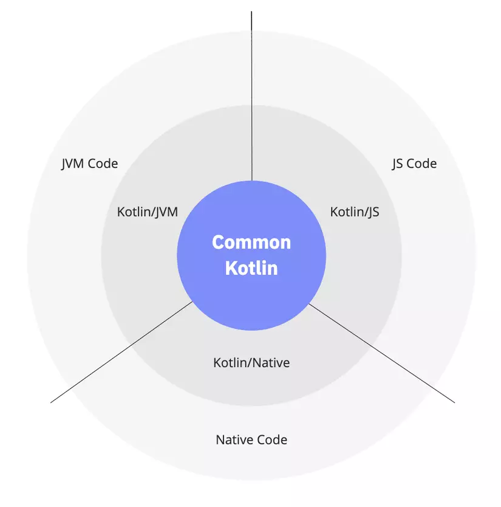
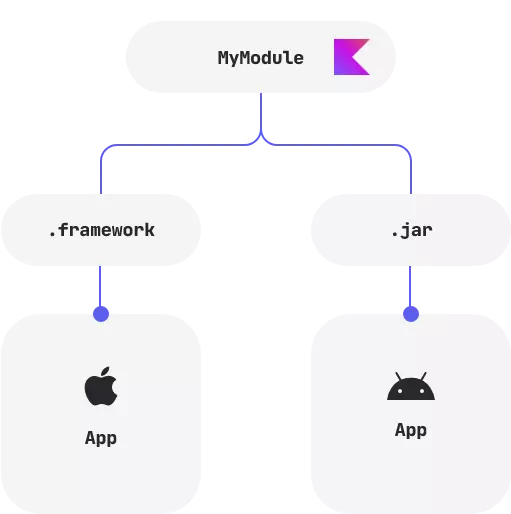

# Introduction

When I first heard about **Kotlin Multiplatform** (hereafter **KM**), I thought, *“What kind of technology only shares logic code? If you want to code fast, just use Flutter, the performance isn’t bad at all.”* But then, life pushed me into a project using KM, and I was truly enlightened about its pros and cons. So, over a drink under the moon, let me share a few words with you.

# What is Kotlin Multiplatform?

KM makes developing cross-platform projects as light as a feather. It helps reduce the time spent writing and maintaining code while keeping the advantages of native for each platform. Kotlin apps can run on Android, iOS, macOS, Windows, Linux, watchOS...


Although KM is still in Beta, it’s quite stable and has been adopted by companies like 9gag, Netflix, Philips, Baidu, VMWare, Quizlet, Memrise...

Back to the question: what advantages does KM have over other cross-platform frameworks?


KM is really suitable for projects with **complex logic code**. We all know that the more code you write, the more bugs you create. The only way to avoid bugs is [No Code](https://github.com/kelseyhightower/nocode). So instead of Android devs writing logic for Android and iOS devs writing logic for iOS, now you only need to write logic once in KM, which already cuts bugs in half.

For example, if a project needs 10 Android devs and 10 iOS devs, with KM you only need 5 Android devs, 5 iOS devs, and 5 KM devs (who can also be Android devs). That means the project reduces resources by 25%. Compared to Flutter, of course, you still need more resources, but in return you get native performance.

# Use Cases

## Android and iOS apps

You can share business logic code between platforms to build a cross-platform mobile app. This is currently the main use case for KM. For example, you can write code from **ViewModel** to **Data layer** in KM, while the Android and iOS apps just build UI with **Jetpack Compose** and **SwiftUI**.

## Full-stack web app

You might not know, but Kotlin can now be used to write front-end web apps. So you can build a full-stack web app with the server using Kotlin/JVM and the web client using Kotlin/JS. Therefore, you can use KM to reuse logic code for both server and client.

## Multiplatform libraries

If Kotlin can build for Android, iOS, and web, why not write a library usable on all three? For projects that need both app and web, try using KM to write common code, publish it as a library, and import it as a dependency in your app or web project.

## Common code for mobile and web apps

You don’t even need to create a library; you can write code directly to share between Android, iOS, desktop, and web apps. This reduces the workload for mobile and front-end web devs, since you only write logic code once. It also reduces bugs and testing time.

# How it works

So how does KM share code across all platforms?



- Common Kotlin is the code that includes core libraries and can run on all platforms.
- With KM libraries, you can reuse **multiplatform logic in common** and **platform-specific code**.
- **Platform-specific code** (Kotlin/JVM, Kotlin/JS, Kotlin/Native) includes extensions for Kotlin, platform-specific libraries, and tools.
- For each platform, you can leverage **platform native code** (JVM, JS, and Native).

For example, to write a function to generate a UUID for both Android and iOS, you can declare a function with the `expect` keyword in the common module:

```kotlin
// Common
expect fun randomUUID(): String
```

Then, for each platform, you implement the function with the `actual` keyword:

```kotlin
// Android
import java.util.*

actual fun randomUUID() = UUID.randomUUID().toString()
```

```swift
// iOS
import platform.Foundation.NSUUID

actual fun randomUUID(): String = NSUUID().UUIDString()
```

# Under the Hood

My project applies KM for Android and iOS apps. I wondered how Kotlin could integrate with iOS apps written in Swift.



JetBrains’ answer is that they use **Kotlin/Native** to compile **Kotlin code** to **native binaries**, so you can run Kotlin code without a virtual machine. It includes an [LLVM](https://llvm.org)-based backend for the Kotlin compiler and a native implementation of the Kotlin standard library.

Kotlin/Native is designed to compile for platforms that can’t run a virtual machine, like embedded devices or iOS.

On Android, Kotlin code is compiled to **JVM bytecode** using **Kotlin/JVM**.

# Conclusion

In the future, JetBrains isn’t stopping at Kotlin Multiplatform—they’re planning to develop [Compose Multiplatform](https://www.jetbrains.com/lp/compose-multiplatform/), which means you’ll be able to share UI as well as logic code, just like other cross-platform frameworks (Flutter, React Native). That’s a long journey ahead, so let’s sit down, have a big meal and a big drink, and see what the future holds.

# Reference

* https://kotlinlang.org/docs/multiplatform.html
* https://kotlinlang.org/docs/multiplatform-mobile-faq.html#what-is-kotlin-native-and-how-does-it-relate-to-kotlin-multiplatform
