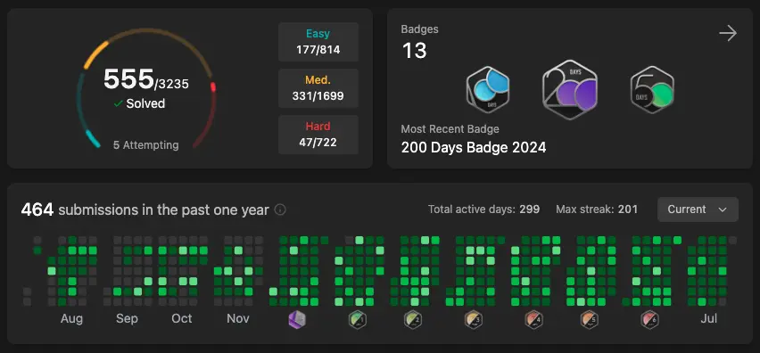

*Photo by [Ashley Batz](https://unsplash.com/@ashleybatz?utm_content=creditCopyText&utm_medium=referral&utm_source=unsplash) on [Unsplash](https://unsplash.com/photos/person-walking-on-beach-during-daytime-betmVWGYcLY?utm_content=creditCopyText&utm_medium=referral&utm_source=unsplash)*

# The Journey Begins

LeetCode is likely familiar to many of you—a platform for solving **algorithm** problems and preparing for **coding interviews**, especially for foreign companies and a few in Vietnam.

I started my journey the same way, simply to prepare for interviews. I realized that practicing problems on LeetCode not only improved my coding skills but also gave me more confidence when facing algorithm and data structure-related interview questions.

I began solving problems **by topic**. This approach helped me systematically organize my knowledge and master specific types of problems. By focusing on one topic at a time, I could deepen my understanding and solve problems more efficiently. Since I didn’t specialize in Computer Science and didn’t participate in algorithm competitions during university, I could manage problems involving **BFS**, **DFS**, **Hash Table**, **Stack**, or **Queue**, but initially struggled with topics like **Dynamic Programming** and **Union Find**. However, as the saying goes, *"Practice makes perfect"*, after solving about ten problems, it became much easier.

In this initial phase, I solved around **100 problems**, which I found sufficient to interview with companies that typically ask easy-to-medium-level questions.

# Sustaining as a Hobby

After passing my interview and joining a good company, I stopped solving problems for about a year. Then, on a beautiful day, I felt inspired to pick it up again. During this second phase, I treated solving LeetCode problems as a daily hobby. I spent around **30 minutes a day** solving one problem from the **Daily Coding Challenge**. This not only helped maintain my algorithm skills but also served as a form of relaxation and self-challenge. Moreover, solving random problems daily better mimicked real-life interview scenarios.

I usually set a 30-minute timer, and if I couldn’t figure out a solution, I’d read the **Editorial** (solutions provided by LeetCode), then try to memorize and code it myself. After every problem, whether solved independently or with help, I would check the **Solutions** section to see how others approached it. The top-voted solutions often showcased creative and optimized methods, sometimes even better than the Editorial solutions.

As the saying goes, *"If you want to go fast, go alone. If you want to go far, go together."* To find companions and exchange experiences, I frequently joined discussions on the voz forum. This not only motivated me but also allowed me to learn various approaches from the community. To maintain motivation, I set a specific goal: reaching **6000 points** to earn the LeetCode T-shirt. Setting clear goals gave me a reason to keep pushing forward every day.

# Achieving the Goal and Deciding to Pause

After about **1.5 years** of consistent effort, on July 26, 2024, I finally achieved my goal of 6000 points and claimed the T-shirt.

However, with work becoming busier, I decided to take a break and focus on current responsibilities. Interestingly, the number of problems I solved happened to be **555**—a perfect milestone. Maybe it’s a signal from the universe.

> When working with Thai colleagues, I learned that **555** in Thai is pronounced like laughter, **Hahaha**. Isn’t this universal signal quite amusing?

Taking a break doesn’t mean giving up. In the future, if I feel inspired or need to prepare for companies that demand higher algorithm expertise, I’ll return to solving problems. The journey of solving 555 LeetCode problems has significantly enhanced my programming skills and logical thinking.

Wishing you all an energetic week ahead!
