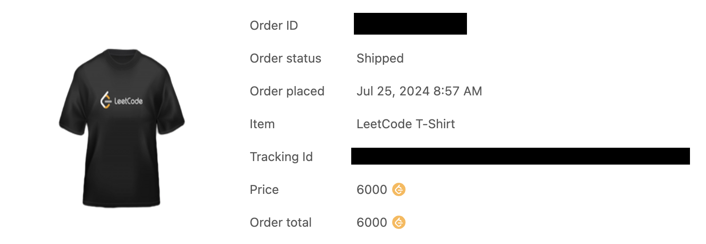

*Photo by [Ashley Batz](https://unsplash.com/@ashleybatz?utm_content=creditCopyText&utm_medium=referral&utm_source=unsplash) on [Unsplash](https://unsplash.com/photos/person-walking-on-beach-during-daytime-betmVWGYcLY?utm_content=creditCopyText&utm_medium=referral&utm_source=unsplash)*

# Hành trình bắt đầu

Có lẽ nhiều bạn không còn xa lạ gì với nền tảng **LeetCode**, một nơi để anh em giải những bài **thuật toán**, chuẩn bị cho vòng **coding interview** vào các công ty, thường là các công ty nước ngoài và một số ít công ty ở Việt Nam.

Mình cũng đã bắt đầu hành trình của mình như vậy, đơn giản chỉ để chuẩn bị cho buổi phỏng vấn. Mình nhận thấy rằng việc làm quen với các bài lập trình trên LeetCode không chỉ giúp mình cải thiện kỹ năng coding mà còn giúp mình tự tin hơn khi đối mặt với các câu hỏi phỏng vấn liên quan đến thuật toán và cấu trúc dữ liệu.

Mình bắt đầu giải các bài tập **theo từng chủ đề**. Điều này giúp mình hệ thống hóa kiến thức và nắm vững từng dạng bài hơn. Bằng cách tập trung vào một chủ đề nhất định, mình có thể hiểu sâu hơn và giải quyết các bài toán một cách hiệu quả hơn. Mình vốn không phải dân chuyên Tin, hồi sinh viên cũng không tham gia các kỳ thi về thuật toán, nên dù các dạng bài về **BFS**, **DFS**, **Hash Table**, **Stack**, **Queue**... có thể giải ổn, nhưng gặp mấy bài kiểu **Dynamic Programming**, **Union Find** thì giai đoạn ban đầu cũng loay hoay ra phết. Nhưng rồi *"trăm hay không bằng tay quen"*, cứ giải khoảng chục bài là bạn sẽ quen tay ngay. Sau giai đoạn đầu này, mình giải được khoảng hơn **100 bài**, mình thấy tầm ấy cũng đủ để đi phỏng vấn một vài công ty mà họ hỏi ở mức độ easy-medium.

# Duy trì như một niềm vui

Sau khi đã vượt qua được buổi phỏng vấn và vào được một công ty ưng ý, mình bẵng đi khoảng 1 năm không làm nữa. Nhưng sau đó, vào một ngày đẹp trời, mình lại có có hứng vào làm tiếp. Trong giai đoạn 2 này, mình duy trì giải các bài toán trên LeetCode như một niềm vui hàng ngày. Mình dành khoảng **30 phút mỗi ngày** để giải một bài trong **Daily Coding Challenge**. Điều này không chỉ giúp mình giữ vững kỹ năng giải thuật toán mà còn là cách thư giãn và thử thách bản thân. Thêm nữa, giải random kiểu này, bạn sẽ không biết trước chủ đề của bài hôm nay là gì, nó sát với thực tế khi bạn đi phỏng vấn hơn.

Mình cũng thường đặt mốc 30 phút, nếu chưa nghĩ ra cách giải thì vào đọc **Editorial** (phần giải của chính LeetCode) xem họ giải như nào, rồi sau đó tự nhớ và code lại. Sau mỗi bài, dù là tự giải hay đọc Editorial, mình cũng vào phần **Solutions** để xem cách giải của những tay to khác, những cái mà được cộng đồng vote nhiều nhất. Họ thường có những cách rất sáng tạo, đôi khi hay hơn cả cách giải của LeetCode.

Các cụ có câu *"Muốn đi nhanh thì đi một mình, muốn đi xa thì đi cùng nhau"*, vậy nên để có người đồng hành và trao đổi kinh nghiệm, mình thường lên diễn đàn voz để thảo luận với anh em. Việc này không chỉ giúp mình có thêm động lực mà còn học hỏi được nhiều cách giải quyết khác nhau từ cộng đồng. Để duy trì động lực, mình cũng đặt mục tiêu cụ thể là đạt **6000 points** để nhận được áo LeetCode. Việc đặt mục tiêu rõ ràng giúp mình có thêm động lực và lý do để tiếp tục mỗi ngày.

# Đạt được mục tiêu và Quyết định dừng lại

Sau khi duy trì trong khoảng **1 năm rưỡi** thì đến ngày 26/7/2024 vừa rồi, mình cũng đạt được mục tiêu 6000 points và đổi được áo.

Tuy nhiên, đợt này công việc cũng bận rộn hơn nên mình quyết định dừng lại một thời gian để nghỉ ngơi và tập trung vào công việc hiện tại. Điều đặc biệt là số bài giải được cũng vừa tròn **555** bài. Chắc là tín hiệu từ vũ trụ rồi.

> Hồi trước làm việc với các bạn Thái Lan mới biết số **555** trong tiếng Thái đồng âm với điệu cười **Hahaha**. Tín hiệu vũ trụ này cũng hay ho phết nhỉ.

Việc tạm dừng không có nghĩa là từ bỏ, trong tương lai khi có hứng thú hoặc cần chuẩn bị cho những công ty yêu cầu thuật toán ở mức độ cao hơn, mình sẽ quay lại giải tiếp. Hành trình giải 555 bài LeetCode đã giúp mình rất nhiều trong việc cải thiện kỹ năng lập trình và tư duy logic.

Chúc các bạn một tuần mới đầy năng lượng!
