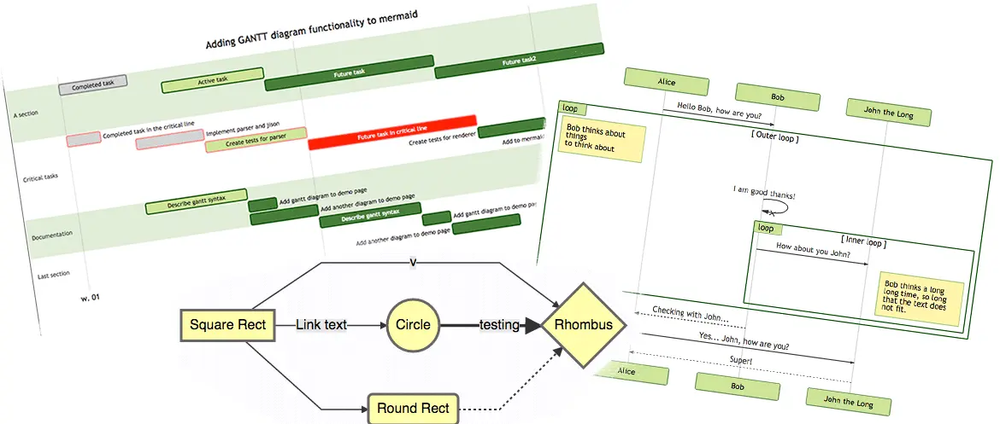
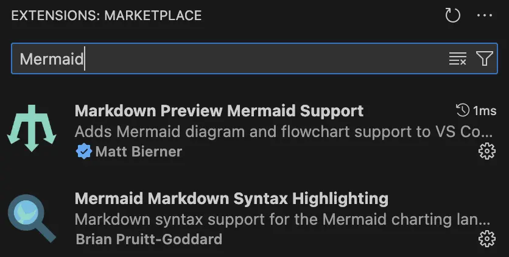
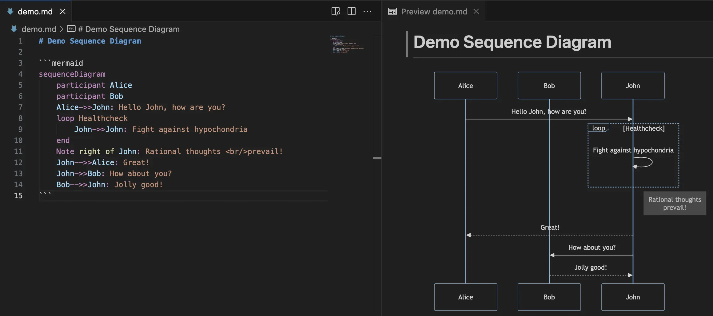
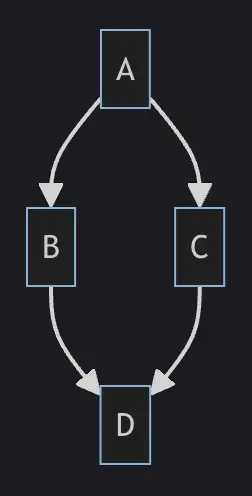
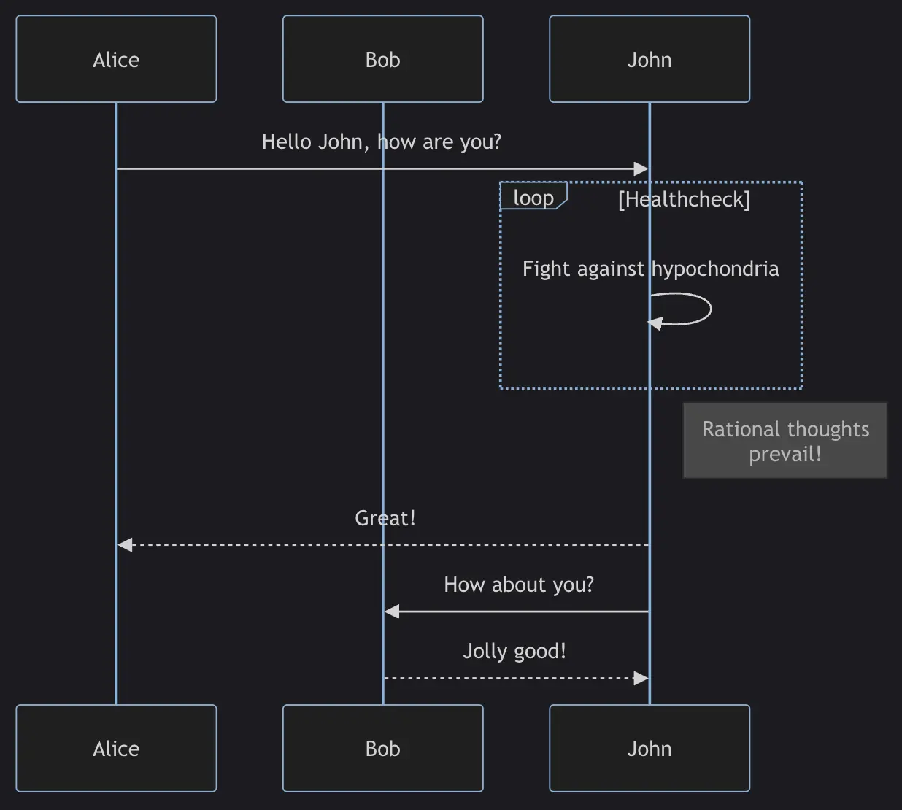
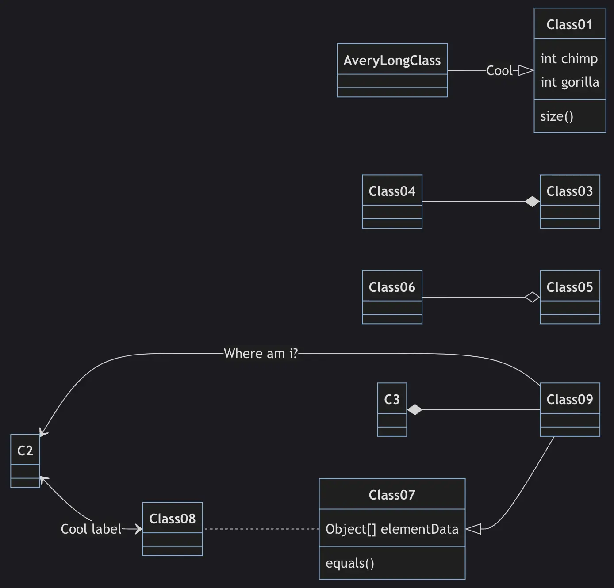
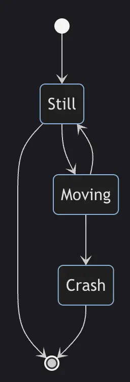
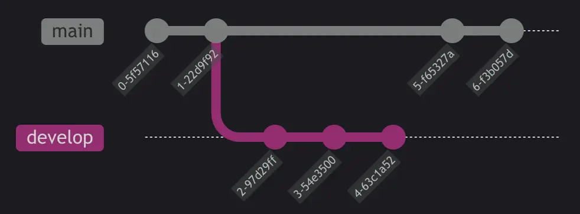

# The Old Days

As you know, diagrams and documentation play an important role in projects. They act as a compass to help developers understand the ideas of PMs, tech leads, or BAs, guide the required flow, and serve as evidence for reference when there are disputes about project requirements. A picture is worth a thousand words; sometimes a clear diagram can save hours of explanation and back-and-forth discussion.

Previously, when drawing diagrams for projects, I often used **[draw.io](https://app.diagrams.net)**. For those who don't know, it's an online tool for drawing diagrams by **drag and drop**. But every time I needed to update a diagram, I had to drag and drop each box or arrow again, which was quite time-consuming. Until one day, a colleague introduced me to **Mermaid**, and everything changed...

# Enlightened by Mermaid

According to the definition on the official website, **[Mermaid](https://mermaid.js.org)** is a tool built on **JavaScript** that helps create **diagrams** and **charts** flexibly from **text** with syntax similar to **Markdown**.



## Advantages

This is an open-source and completely free tool. It supports many popular types of diagrams and charts such as **Flowchart**, **Sequence diagram**, **Class diagram**, **State diagram**, **Git graph**...

The syntax is very simple and easy to learn. If you're already familiar with Markdown, you just need to spend a little time to master it. Now, whenever project requirements change, you only need to edit a few lines of text and the diagram will be updated quickly.

For simple diagrams, you can use **[Mermaid Live Editor](https://mermaid.live)** without installing anything. For company projects, Mermaid is already integrated with **Notion** or **Atlassian** products. If you want to use it locally, Mermaid works right in popular IDEs like **Visual Studio Code** or JetBrains family.

## Comparison with PlantUML

There are other tools on the market that render diagrams from text like Mermaid, the most notable being **[PlantUML](https://plantuml.com)**. Below is a comparison table for an overview.

| Criteria                | Mermaid                                         | PlantUML                                             |
|-------------------------|-------------------------------------------------|------------------------------------------------------|
| GitHub Star (25/2/2024) | [65,400](https://github.com/mermaid-js/mermaid) | [9,300](https://github.com/plantuml/plantuml)        |
| Diagram types           | Flow, Sequence, Class, State, Git graph...      | Sequence, Usecase, Class, Object, Activity, State... |
| Online support          | Yes                                             | Yes                                                  |
| Offline support         | Yes                                             | Yes                                                  |
| Pricing                 | Free                                            | Free                                                 |
| Others                  | Easy to learn, user-friendly for beginners      | Many extension libraries                             |

# Installation on Visual Studio Code

Currently, in my project, the team is creating a separate project for diagrams, using **Git** for version control and **Visual Studio Code** for drawing.

You only need to install 2 extensions: [Markdown Preview Mermaid Support](https://marketplace.visualstudio.com/items?itemName=bierner.markdown-mermaid) and [Mermaid Markdown Syntax Highlighting](https://marketplace.visualstudio.com/items?itemName=bpruitt-goddard.mermaid-markdown-syntax-highlighting) on Visual Studio Code to get started.



Whenever you need to draw a diagram, create a file with the `.md` extension and write the Mermaid syntax. You can click the **Open Preview** button in the top right corner to code and see the diagram updated live beside it. The result is as follows:



Just check out the example first, and I'll go into detail about the syntax for each type of diagram in the next section.

# Syntax for Common Diagrams

## [Flowchart](https://mermaid.js.org/syntax/flowchart.html)

A flowchart consists of **nodes** and **edges** (which can be **undirected edges** or **directed arrows**). The Mermaid code will determine how to create the nodes and edges, with customizable edge types according to the drawer's intention.

Sample syntax:

```
flowchart TD
    A-->B;
    A-->C;
    B-->D;
    C-->D;
```

- `flowchart`: the keyword for this type of chart (you can also use `graph` interchangeably).
- `TD`: the direction of the chart (top to down). Other options include:
    - `TB`: top to bottom (same as top to down)
    - `BT`: bottom to top
    - `RL`: right to left
    - `LR`: left to right
- `A`, `B`, `C`, `D`: the names of the nodes. Besides the default rectangle, you can also use other shapes like rounded rectangles, trapezoids, circles, etc.
- `-->`: directed edge type. There are also undirected, bidirectional types, and types with attached text...

Result:



## [Sequence diagram](https://mermaid.js.org/syntax/sequenceDiagram.html)

A sequence diagram is an **interaction diagram** that shows how different **processes** operate with each other **and in what order**.

Sample syntax:

```
sequenceDiagram
    participant Alice
    participant Bob
    participant John
    Alice->>John: Hello John, how are you?
    loop Healthcheck
        John->>John: Fight against hypochondria
    end
    Note right of John: Rational thoughts <br/>prevail!
    John-->>Alice: Great!
    John->>Bob: How about you?
    Bob-->>John: Jolly good!
```

- `sequenceDiagram`: the keyword for the diagram.
- `participant`: defines the participants in the diagram in sequential order. In this example, we have 3 participants: `Alice`, `Bob`, and `John`.
- Each line defines the message between the participants.
- `->>`, `-->>`: directed message types with solid and dashed lines.

Result:



## [Class diagram](https://mermaid.js.org/syntax/classDiagram.html)

A class diagram in **UML** (Unified Modeling Language) is a type of **static structure diagram** that describes the **structure of a system** by showing the **classes** of the system, their **attributes**, **operations** (or methods), and the **relationships between objects**.

Sample syntax:

```
classDiagram
    Class01 <|-- AveryLongClass : Cool
    Class03 *-- Class04
    Class05 o-- Class06
    Class07 .. Class08
    Class09 --> C2 : Where am i?
    Class09 --* C3
    Class09 --|> Class07
    Class07 : equals()
    Class07 : Object[] elementData
    Class01 : size()
    Class01 : int chimp
    Class01 : int gorilla
    Class08 <--> C2: Cool label
```

- `classDiagram`: the keyword for the diagram.
- `chimp`, `gorilla`, `elementData`: attributes of the classes.
- `size()`, `equals()`: methods of the classes.
- `*--`, `o--`: relationships between classes.

Result:



## [State diagram](https://mermaid.js.org/syntax/stateDiagram.html)

A state diagram is a type of diagram that describes the **behavior of a system**, showing some of the system's states.

Sample syntax:

```
stateDiagram
    [*] --> Still
    Still --> [*]

    Still --> Moving
    Moving --> Still
    Moving --> Crash
    Crash --> [*]
```

- `stateDiagram`: the keyword for the diagram.
- `[*]`: start or end point.
- `Still`, `Moving`, `Crash`: the states of the system.
- `-->`: state transition steps.

Result:



## [Git graph](https://mermaid.js.org/syntax/gitgraph.html)

A git graph illustrates **git commits** and **git actions** (commands) on different **branches**.

Sample syntax:

```
gitGraph
   commit
   commit
   branch develop
   commit
   commit
   commit
   checkout main
   commit
   commit
```

- `gitGraph`: the keyword for the graph.
- `commit`: creates a new commit on the current branch.
- `branch`: creates and switches to a new branch, setting it as the current branch.
- `checkout`: checks out an existing branch and sets it as the current branch.
- `merge`: merges a branch into the current branch.

Result:



# Conclusion

Mermaid is truly **powerful** and **flexible**; it provides us with many **options** to draw various types of diagrams. However, in this short article, I couldn't introduce all those options to you. If you need more details, you can refer to the Mermaid documentation linked in each title section. I hope you now have an overview of Mermaid and can apply it in your projects or your team's projects, helping save time and effort.
