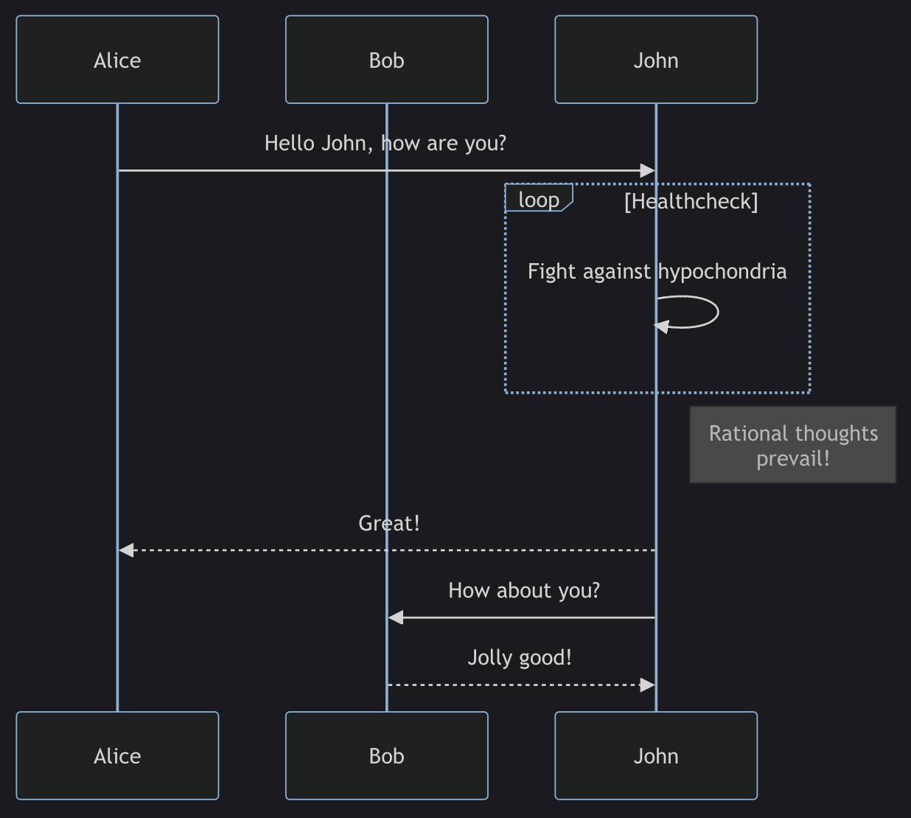
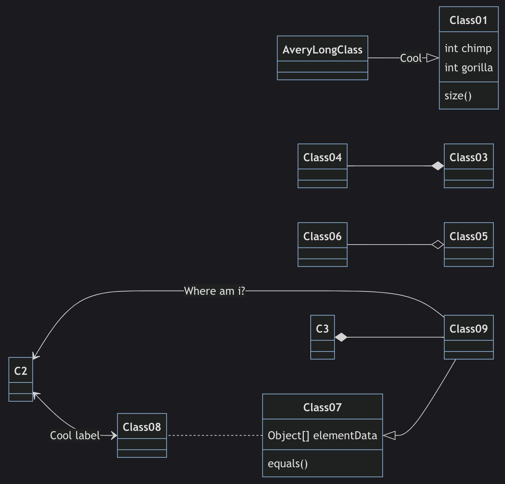
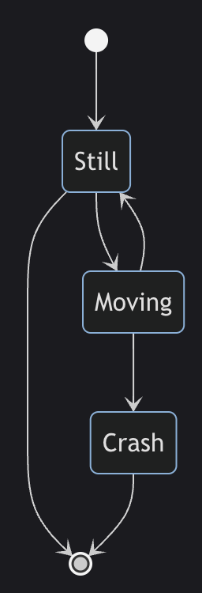

# Những ngày xưa cũ

Anh em cũng biết rằng, diagram nói riêng và document nói chung có vai trò quan trọng trong các dự án, nó như một chiếc la bàn giúp anh em dev hiểu được ý tưởng của PM, tech lead hay BA, định hướng được flow cần làm, đồng thời là bằng chứng để anh em đối chiếu khi có tranh cãi về yêu cầu của dự án. Một bức ảnh đáng giá hơn ngàn lời nói, đôi khi một cái diagram rõ ràng sẽ giúp tiết kiệm được vài giờ đồng hồ giải thích, trao đổi qua lại.

Trước đây, khi vẽ diagram cho dự án, mình thường dùng **[draw.io](https://app.diagrams.net)**. Cho bạn nào chưa biết thì nó là một tool online vẽ diagram bằng cách **kéo thả**. Nhưng mỗi khi cần update lại diagram, mình phải kéo thả lại từng ô hay từng cái mũi tên khá mất thời gian. Cho đến một ngày mình được một người anh giới thiệu về **Mermaid**, mọi chuyện đã bước sang một trang mới...

# Được khai sáng về Mermaid

Theo định nghĩa trên trang chủ thì **[Mermaid](https://mermaid.js.org)** là một công cụ được xây dựng dựa trên **JavaScript**, giúp tạo **diagram** và **chart** một cách linh hoạt từ **text** có cú pháp tương tự **Markdown**.


## Ưu điểm

Đây là một công cụ mã nguồn mở và hoàn toàn miễn phí. Nó hỗ trợ nhiều loại diagram và chart phổ biến như **Flowchart**, **Sequence diagram**, **Class diagram**, **State diagram**, **Git graph**...

Cú pháp cũng rất đơn giản và dễ học. Nếu bạn đã quen thuộc với Markdown thì chỉ cần dành chút thời gian là sẽ thông thạo. Giờ đây, mỗi khi yêu cầu của dự án thay đổi, bạn chỉ cần sửa vài dòng text thôi thì diagram sẽ được update theo một cách nhanh chóng.

Với mục đích vẽ các diagram đơn giản, các bạn hoàn toàn có thể sử dụng **[Mermaid Live Editor](https://mermaid.live)**, không cần cài đặt bất cứ thứ gì. Với các dự án của công ty, Mermaid cũng đã được tích hợp với **Notion** hoặc các sản phẩm của **Atlassian**. Còn nếu bạn muốn sử dụng ở local thì Mermaid có thể dùng ngay trên các IDE phổ biến như **Visual Studio Code** hoặc họ nhà **JetBrains**.

## So sánh với PlantUML

Trên thị trường hiện tại cũng đã có một số công cụ khác render diagram từ text như Mermaid, trong đó nổi bật nhất là **[PlantUML](https://plantuml.com)**. Sau đây mình sẽ đưa ra một bảng so sánh để các bạn có cái nhìn tổng quan.

| Tiêu chí | Mermaid | PlantUML |
| -------- | -------- | -------- |
| GitHub Star (25/2/2024) | [65.400](https://github.com/mermaid-js/mermaid) | [9.300](https://github.com/plantuml/plantuml) |
| Loại diagram | Flow, Sequence, Class, State, Git graph...  | Sequence, Usecase, Class, Object, Activity, State... |
| Hỗ trợ online | Có | Có |
| Hỗ trợ offline | Có | Có |
| Tính phí | Miễn phí | Miễn phí |
| Khác | Dễ học, dễ sử dụng cho người mới | Có nhiều thư viện mở rộng |

# Cài đặt trên Visual Studio Code

Hiện tại ở dự án của mình thì team đang tạo riêng một project cho các diagram, dùng **Git** để quản lý version và dùng **Visual Studio Code** để vẽ.

Bạn chỉ cần cài thêm 2 extension [Markdown Preview Mermaid Support](https://marketplace.visualstudio.com/items?itemName=bierner.markdown-mermaid) và [Mermaid Markdown Syntax Highlighting](https://marketplace.visualstudio.com/items?itemName=bpruitt-goddard.mermaid-markdown-syntax-highlighting) trên Visual Studio Code là đủ dùng rồi.


Mỗi khi cần vẽ 1 diagram, bạn tạo 1 file với đuôi `.md` và viết cú pháp của Mermaid, bạn có thể click button **Open Preview** ở góc trên bên phải để vừa code vừa xem diagram được update trực tiếp ở bên cạnh. Và kết quả như sau:


Bạn cứ xem trước ví dụ đi đã, mình sẽ đi vào giới thiệu chi tiết cú pháp của từng loại diagram trong phần tiếp theo.

# Cú pháp các diagram phổ biến

## [Flowchart](https://mermaid.js.org/syntax/flowchart.html)

Flowchart bao gồm các **node** và các **cạnh** (có thể là **đường vô hướng** hoặc **mũi tên có hướng**). Code Mermaid sẽ xác định cách tạo các node và cạnh, các loại cạnh tuỳ chỉnh theo mục đích của người vẽ.

Cú pháp mẫu:

```
flowchart TD
    A-->B;
    A-->C;
    B-->D;
    C-->D;
```

- `flowchart`: keyword của loại chart này (bạn có thể dùng `graph` cũng tương đương).
- `TD`: hướng của chart (top to down). Ngoài ra còn có:
    - `TB`: top to bottom (giống top to down)
    - `BT`: bottom to top
    - `RL`: right to left
    - `LR`: left to right
- `A`, `B`, `C`, `D`: tên của các node. Ngoài hình chữ nhật mặc định, bạn cũng có thể dùng nhiều loại hình khác như hình chữ nhật bo tròn, hình thang, hình tròn...
- `-->`: loại cạnh có hướng. Ngoài ra còn các loại vô hướng, đa hướng, có gắn text...

Kết quả:


## [Sequence diagram](https://mermaid.js.org/syntax/sequenceDiagram.html)

Sequence diagram là **sơ đồ tương tác** cho thấy các **quy trình hoạt động** với nhau **như thế nào** và theo **thứ tự nào**.

Cú pháp mẫu:

```
sequenceDiagram
    participant Alice
    participant Bob
    participant John
    Alice->>John: Hello John, how are you?
    loop Healthcheck
        John->>John: Fight against hypochondria
    end
    Note right of John: Rational thoughts <br/>prevail!
    John-->>Alice: Great!
    John->>Bob: How about you?
    Bob-->>John: Jolly good!
```

- `sequenceDiagram`: keyword của diagram.
- `participant`: định nghĩa các thành phần tham gia diagram theo thứ tự lần lượt. Như trong ví dụ này, chúng ta có 3 thành phần là `Alice`, `Bob` và `John`.
- Mỗi dòng lần lượt định nghĩa tin nhắn giữa các thành phần.
- `->>`, `-->>`: các loại tin nhắn có hướng nét liền và nét đứt.

Kết quả:



## [Class diagram](https://mermaid.js.org/syntax/classDiagram.html)

Class diagram trong **UML** (Unified Modeling Language) là một loại **sơ đồ cấu trúc tĩnh** mô tả **cấu trúc của hệ thống** bằng cách hiển thị các **lớp** của hệ thống, **thuộc tính**, **hoạt động** (hoặc phương thức) của chúng và **mối quan hệ giữa các đối tượng**.

Cú pháp mẫu:

```
classDiagram
    Class01 <|-- AveryLongClass : Cool
    Class03 *-- Class04
    Class05 o-- Class06
    Class07 .. Class08
    Class09 --> C2 : Where am i?
    Class09 --* C3
    Class09 --|> Class07
    Class07 : equals()
    Class07 : Object[] elementData
    Class01 : size()
    Class01 : int chimp
    Class01 : int gorilla
    Class08 <--> C2: Cool label
```

- `classDiagram`: keyword của diagram.
- `chimp`, `gorilla`, `elementData`: thuộc tính của các lớp.
- `size()`, `equals()`: phương thức của các lớp.
- `*--`, `o--`: mối quan hệ của các lớp.

Kết quả:



## [State diagram](https://mermaid.js.org/syntax/stateDiagram.html)

State diagram là một loại sơ đồ để mô tả **hành vi của hệ thống**, nó thể hiện một số các trạng thái của hệ thống.

Cú pháp mẫu:

```
stateDiagram
    [*] --> Still
    Still --> [*]

    Still --> Moving
    Moving --> Still
    Moving --> Crash
    Crash --> [*]
```

- `stateDiagram`: keyword của diagram.
- `[*]`: điểm bắt đầu hoặc kết thúc.
- `Still`, `Moving`, `Crash`: các trạng thái của hệ thống.
- `-->`: các bước chuyển đổi trạng thái.

Kết quả:



## [Git graph](https://mermaid.js.org/syntax/gitgraph.html)

Git graph là minh hoạ của **git commits** và **git actions** (commands) trên các **branch** khác nhau.

Cú pháp mẫu:

```
gitGraph
   commit
   commit
   branch develop
   commit
   commit
   commit
   checkout main
   commit
   commit
```

- `gitGraph`: keyword của graph.
- `commit`: tạo một commit mới trên branch hiện tại.
- `branch`: tạo và chuyển sang một branch mới, set nó thành current branch.
- `checkout`: checkout về một branch đã tồn tại và set nó thành current branch.
- `merge`: merge một branch vào current branch.

Kết quả:


# Kết luận

Mermaid thực sự rất **mạnh mẽ** và **linh hoạt**, nó cung cấp cho chúng ta nhiều **option** để vẽ các loại diagram. Tuy nhiên trong bài viết ngắn này, mình chưa thể giới thiệu hết với anh em các option đó. Nếu mọi người cần chi tiết hơn, có thể tham khảo document của Mermaid mình đính kèm ở từng phần title. Hy vọng các bạn đã có cái nhìn tổng quan về Mermaid và có thể áp dụng nó vào trong các dự án của mình hoặc của team, giúp anh em tiết kiệm thời gian và công sức.
