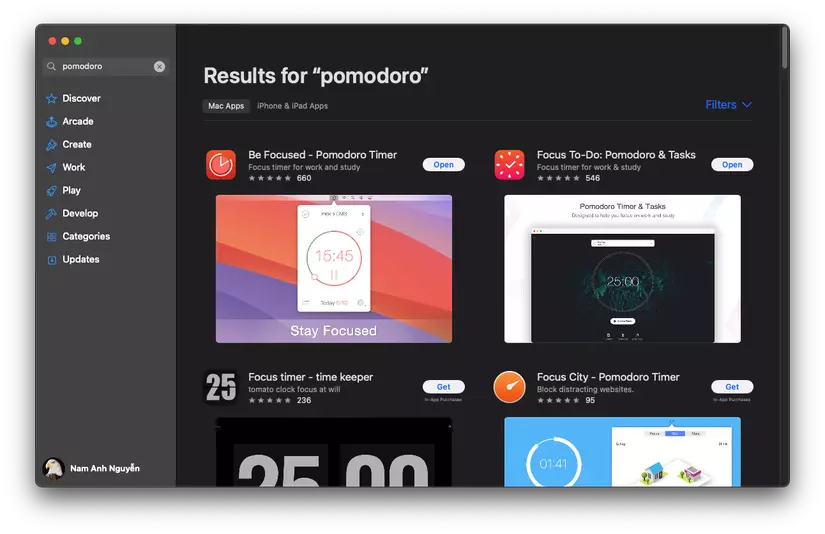

# What is Pomodoro?

Recently, my work has shifted a bit, and I find myself in an average of 4 meetings every day. Consequently, I often end up accomplishing very little throughout the day. So, I sought a **time management method** called **Pomodoro** to help me focus better on my tasks. It wasn't until I applied it that I realized the actual coding time in a day is not as much as I thought.

**Pomodoro** is an Italian word, meaning tomato, because when Francesco Cirillo developed this method in the late 1980s, he used a tomato-shaped kitchen timer. In brief, this method consists of several steps:

1. Set the tasks to be done.
2. Set a timer for **25 minutes** (this time is called a pomodoro).
3. Work on the task.
4. Finish the task and take a **5-minute break**.
5. After **4** pomodoros, take a **15-minute break**.

To apply Pomodoro, there are many apps, extensions, or even web applications available for you to use. You can find the one that suits you best. Personally, I am using the **Focus To-Do** app on the App Store, which is quite sufficient for my basic needs.

Now, after applying it for **6 tháng**, I want to share with you the benefits it brings, as well as the points I think it may not be suitable.

# Improving Focus

Previously, there were days when I was extremely focused for 4-5 consecutive hours, which helped me accomplish a lot of tasks. However, after such days, I often felt quite tired.

But there were also days when I spent the whole hour reading news, scrolling through Facebook, and suddenly realized I hadn't accomplished anything.

The human brain is truly effective when concentrated for a short period with reasonable breaks. Applying Pomodoro, knowing I only need to focus for 25 minutes, a not too long duration, allows me to fully concentrate on the task without worrying about getting tired at the end of the day. I also know that after these 25 minutes, I will have a break, so there's no temptation to turn to Facebook during work.

During one pomodoro, you should only focus on one task. For example, if you are working on task A, only work on task A. If you finish it before the pomodoro ends, spend the remaining time checking it again, but don't jump to task B.

# Improving Health

When it's time for a **5-minute break**, instead of continuing to stare at the computer, I usually take the time to go to the restroom, get more water, change my playlist, or simply stand up and move around. This helps relax my body, avoiding health issues from sitting for too long.

However, I find the 5-minute duration a bit short; sometimes, I haven't done anything, and it's already over in 5 minutes. Therefore, in the future, I may consider adjusting it to 7 or 8 minutes and see how it goes.

# Ignoring the World

According to the rule, during the 25-minute focused period, you should turn off all app notifications to avoid distraction. However, I haven't reached the point of being able to ignore the whole world because I still need to receive chat notifications to respond to customers and colleagues promptly.

However, this often disrupts my Pomodoro because I have to spend additional time checking code or documents to be able to respond to people.

# Conclusion

This method may be suitable for me but may not necessarily be suitable for you. Adhering to Pomodoro has helped me increase work efficiency, but sometimes it makes me feel like I'm working like a machine. Try applying it and see the results it brings for you.
