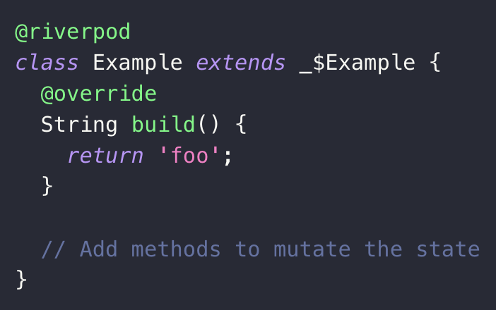
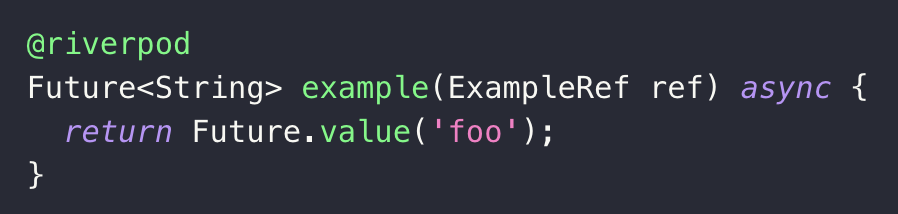

*Photo by [Dillon Shook](https://unsplash.com/@dillonjshook?utm_content=creditCopyText&utm_medium=referral&utm_source=unsplash) on [Unsplash](https://unsplash.com/photos/person-sitting-on-sofa-resting-its-feet-on-top-of-coffee-table-while-using-laptop-3iPKIXVXv_U?utm_content=creditCopyText&utm_medium=referral&utm_source=unsplash)*

Không biết có bạn nào luôn băn khoăn mỗi lần phải chọn 1 trong 7 loại **provider** của **Riverpod** cho từng use case trong dự án của mình chưa? Ví dụ như 2 loại **NotifierProvider** và **StateNotifierProvider** trong [document](https://riverpod.dev/docs/concepts/providers#different-types-of-providers) đều được lấy ví dụ là dùng trong trường hợp:

> Một state object phức tạp không thể thay đổi trừ khi thông qua một interface.

Hoặc chính **ChangeNotifierProvider** lại được khuyên là không nên dùng cho các app có khả năng cần scale sau này.

Gì vậy trời??? Tác giả thật biết cách khiến cho anh em dev thấy hoang mang mà...

Nhưng giờ đây, tác giả **Remi Rousselet** đã giới thiệu cách dùng **Riverpod** mới với **code generation**, giúp cho cuộc đời của developer chúng ta dễ thở hơn đôi chút.

# Syntax

Giải thích một cách đơn giản, **code generation trong Riverpod** là cách chúng ta khai báo các provider với annotation `@riverpod`, và phần lớn code còn lại sẽ được tạo ra tự động với tool `build_runner` có sẵn của Dart.

Thay vì định nghĩa provider như trước đây:

```dart
final fetchUserProvider = FutureProvider.autoDispose.family<User, int>((ref, userId) async {
    final json = await http.get('api/user/$userId');
    return User.fromJson(json);
});
```

Bây giờ chúng ta chỉ cần viết:

```dart
@riverpod
Future<User> fetchUser(FetchUserRef ref, {required int userId}) async {
    final json = await http.get('api/user/$userId');
    return User.fromJson(json);
}
```

Thay vì phải ngồi suy nghĩ để chọn lựa 1 trong 7 provider như trước đây, bây giờ bạn có thể xem bảng sau và chọn ra provider phù hợp với use case của mình một cách nhanh chóng:

|  | Functional <br> (Không thể cập nhật <br> bằng public methods) | Class-Based <br> (Có thể cập nhật <br> bằng public methods) |
| -------- | -------- | -------- |
| Sync |  |  |
| Async - Future |  |  |
| Async - Stream |  |  |

## keepAlive

Theo cách viết mới này, mặc định tất cả provider sẽ là **auto dispose**, nghĩa là state sẽ bị destroy khi provider không còn listener nào observe nó nữa. Nó hơi ngược với cách viết cũ (bạn phải thêm `autoDispose`, còn mặc định sẽ không bị dispose).

Vậy nên, để disable tính năng auto dispose này đi, giữ cho provider của bạn luôn sống, thay vì khai báo `@riverpod` bạn phải viết thành:

```dart
@Riverpod(keepAlive: true)
```

## Param

Như bạn có thể thấy ở ví dụ ban đầu, việc thêm **param** cho provider bây giờ không khác gì thêm param cho một function thông thường cả. Chúng ta không cần dùng đến `family` như cách code cũ.

Với Functional provider, chúng ta thêm trực tiếp vào function như sau:

```dart
@riverpod
String example(
    ExampleRef ref,
    int param1, {
    String param2 = 'foo',
}) {
    return 'Hello $param1 & param2';
}
```

Còn đối với Class-Based provider, chúng ta sẽ thêm vào method `build` như sau:

```dart
@riverpod
class Example extends _$Example {
    @override
    String build(
        int param1, {
        String param2 = 'foo',
    }) {
        return 'Hello $param1 & param2';
    }

    // Add methods to mutate the state
}
```

# Ưu điểm

Hiện tại, việc sử dụng code generation hay cách code cũ vẫn là optional. Nếu bạn vẫn đang cân nhắc lý do để chuyển đổi thì đây là những lý do tác giả đưa ra cho bạn:

* Syntax tốt hơn, dễ đọc, dễ học và linh hoạt hơn.
  * Chúng ta không cần phải lo lắng về việc chọn provider nào nữa. Chỉ cần viết logic code và Riverpod sẽ chọn loại **phù hợp nhất** cho bạn.
  * Syntax không còn giống như một **biến global** nữa, mà chỉ như một **custom function** hay **custom class**.
  * Việc truyền param tới provider **không còn bị giới hạn**. Chúng ta có thể truyền **named param**, **optional param** hoặc **default value**.
* **Stateful hot-reload code** được viết trong Riverpod.
* Debug tốt hơn.
* Một vài feature chỉ có thể dùng với code generation.

# Nhược điểm

Tuy nhiên, trong quá trình áp dụng vào dự án thực tế, nó vẫn có một số nhược điểm mà bạn nên lưu tâm.

Hiện tại, do code generation mới ra mắt không lâu nên có **khá ít dự án áp dụng**. Vì vậy, bạn cũng sẽ **khó tìm thấy source code** để tham khảo. Gần như trong quá trình làm việc, nguồn tham khảo duy nhất của mình chỉ là **document của Riverpod**.

Trong thời đại AI này, anh em cũng thường xuyên áp dụng các tool để **generate code**. Đầu vào đã ít thì lấy đâu ra đầu ra, vậy nên khi bạn dùng tool, hầu hết nó sẽ generate code Riverpod theo kiểu cũ. Nhưng đừng lo vì trên Android Studio cũng đã có plugin [Flutter Riverpod Snippets](https://plugins.jetbrains.com/plugin/14641-flutter-riverpod-snippets), giúp bạn gõ code nhanh hơn chút. Chỉ cần gõ riverpod là nó sẽ gợi ý cho bạn 4 loại provider trên.

Những nhược điểm này chỉ mang tính tạm thời, khi code generation trở nên phổ biến hơn, chắc chắn chúng sẽ được khắc phục. Vậy nên bạn không cần phải quá lo lắng.

# Reference

* https://riverpod.dev/docs/concepts/about_code_generation
