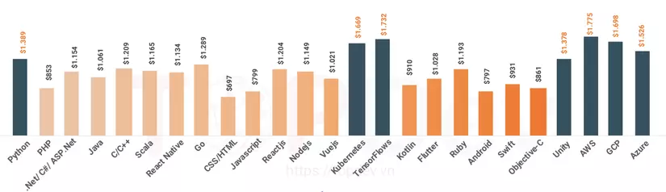
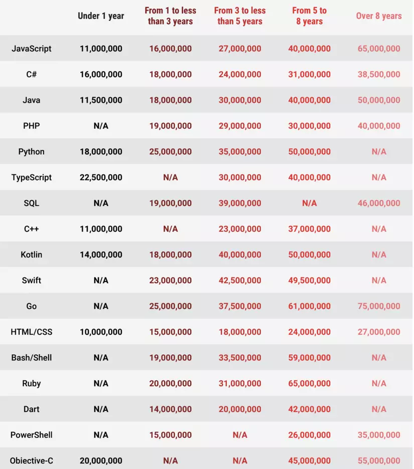
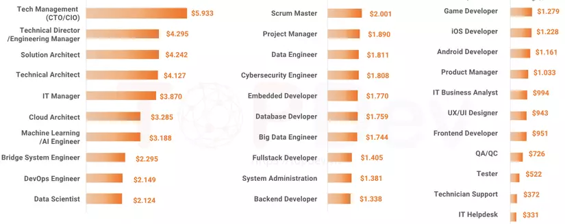
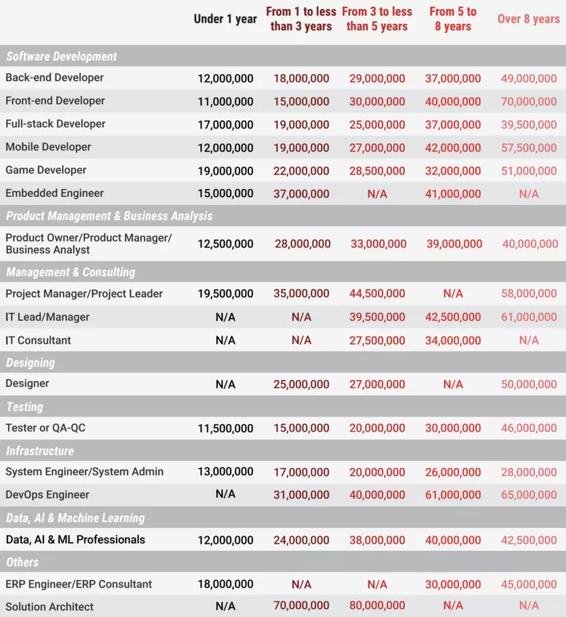
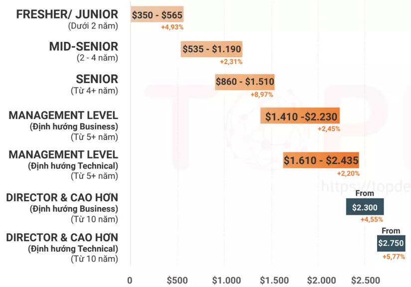
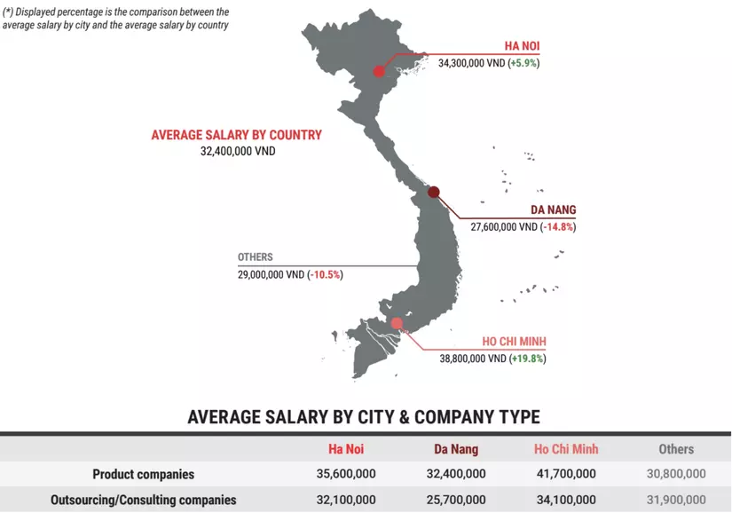

# Hoàn cảnh

Hôm vừa rồi một người em bên Nhật chia sẻ với mình rằng muốn mở công ty ở Việt Nam, nhưng chưa hiểu về thị trường hiện tại ở Việt Nam lắm. Mình đành dốc hết những kiến thức nông cạn của mình ra chia sẻ với em về môi trường, công việc cũng như lương thưởng của anh em dev ở Hà Nội, thành phố Hồ Chí Minh và Đà Nẵng...

Dẫu biết rằng thị trường đang ảm đạm, làn sóng sa thải cũng đã lan đến Việt Nam từ cuối năm 2022 đến thời điểm hiện tại là tháng 5/2023, nhưng thật sự chưa có một báo cáo đáng tin cậy để đánh giá về tình hình năm 2023 này. Vậy nên mình sẽ dựa vào báo cáo gần nhất của 2 bên [**TopDev**](https://topdev.vn/page/bao-cao-it-viet-nam) và [**ITViec**](https://itviec.com/blog/bao-cao-luong-it) trong năm 2022 để đưa ra góc nhìn về mức lương thưởng của anh em.

Trong báo cáo của **TopDev** có đưa ra cả đánh giá về tình hình tuyển dụng, nhưng mình nghĩ rằng gió đã đổi chiều nên những đánh giá đó không còn chính xác trong năm 2023 này. Còn về lương thưởng, khác với tình hình năm 2020 khi các công ty giảm lương nhân viên để vượt qua giai đoạn khó khăn, trong năm 2023 này, hầu hết các công ty chỉ đưa ra lựa chọn giữ người hoặc sa thải, vậy nên mức lương của những người ở lại sẽ ít bị ảnh hưởng.

**ITViec** khảo sát **1.257 chuyên gia IT** còn **TopDev** thì dựa trên **48.179 ứng viên IT**, **100.000 dữ liệu việc làm** được phân tích và thông tin của **2.500 nhà tuyển dụng**. Bởi vì khảo sát với một volumn nhỏ thì sẽ có sự sai lệch nhất định so với thị trường, vậy nên mình mới dùng báo cáo của cả 2 bên để mong rằng giảm tối đa sự sai lệch đó và giúp chúng ta có một góc nhìn khách quan nhất.

# Mức lương theo công nghệ

Trong biểu đồ trên, **TopDev** thể hiện mức lương của các dev từ 3 năm kinh nghiệm trở xuống. Vậy nên mình thấy nó hơi thấp và không phản ánh được mức lương của senior dev có từ 4-5 năm kinh nghiệm trở lên.

Top công nghệ được trả lương cao nhất gồm các công nghệ theo xu hướng như **AI** (Kubernetes, TensorFlows, Python), **Cloud Computing** (AWS, GCP, Azure). Unity cũng lọt top nhờ trend **play-to-earn** nổi đình nổi đám trong năm 2022.

Bảng số liệu của **ITViec** thể hiện chi tiết hơn mức lương cho từng ngôn ngữ lập trình theo số năm kinh nghiệm. **Python** vẫn là một trong những ngôn ngữ được trả lương cao, nhưng **Go** - một ngôn ngữ đang trở thành trending - mới là vũ khí giúp anh em dev được trả lương cao nhất.

# Mức lương theo vị trí

Biểu đồ này của **TopDev** vẫn thể hiện mức lương của các dev từ 3 năm kinh nghiệm trở xuống.

Các vị trí **CTO**, **CIO** hoặc **Tech Management** vốn vẫn được coi là mục tiêu nghề nghiệp cao nhất, họ phải nắm các kỹ năng cơ bản vững chắc, xử lý các công việc quản lý, tối ưu hóa công nghệ / sản phẩm và điều chỉnh kịp thời.

Các vị trí được trả lương cao tiếp theo yêu cầu các kỹ năng đặc biệt như **Data**, **Cloud**, **DevOps** hoặc **AI**.

Trong bảng số liệu của **ITViec**, các vị trí trên vẫn được trả mức lương rất tốt. Nhưng đối với các dev từ 5 năm kinh nghiệm trở lên trong lĩnh vực khác (**Front-end**, **Mobile**), họ cũng được trả mức lương không hề kém cạnh.

Điều này chứng minh rằng bạn không cần phải luôn chạy theo những công nghệ hot, chỉ cần bạn đủ giỏi, thì với vị trí nào, bạn cũng được trả mức lương tương xứng.

# Mức lương theo trình độ

**TopDev** chỉ đưa ra một biểu đồ chung về mức lương theo số năm kinh nghiệm. Trong 5 năm đầu tiên, lương của lập trình viên dao động từ **$350** (Fresher) đến dưới **$1.190** cho Mid-Senior. Đối với các lập trình viên từ 5 năm kinh nghiệm, mức lương chênh lệch chủ yếu dựa trên vị trí và trách nhiệm đối với hoạt động kinh doanh. Giám đốc hoặc cấp cao hơn sẽ có mức lương ít nhất là **$2.300**. Mức lương của cấp quản lý kỹ thuật sẽ cao hơn so với cấp quản lý/giám đốc theo định hướng kinh doanh.

# Mức lương theo thành phố

Có lẽ nhiều anh em cũng đã biết trước kết quả về bảng số liệu này của **ITViec**. Nhìn chung thì mức lương ở thành phố Hồ Chí Minh cao hơn Hà Nội, và Hà Nội thì lại cao hơn Đà Nẵng.

Theo mình có lẽ vì thành phố Hồ Chí Minh gồm nhiều công ty product và outsource làm với thị trường nói tiếng Anh hơn. Còn ở Hà Nội vẫn gồm nhiều các công ty làm cho thị trường Nhật. Tuy nhiên trong giai đoạn gần đây, đã có nhiều công ty từ thành phố Hồ Chí Minh Bắc tiến ra Hà Nội, điều đó cũng đã giúp thị trường ở Hà Nội nhộn nhịp hơn rất nhiều.

# Lời kết

Cũng phải nhìn nhận rằng, những anh em không may bị sa thải trong giai đoạn này sẽ phải tìm một công việc mới và có thể phải chấp nhận một mức lương thấp hơn mức cũ. Điều đó cũng góp phần làm cho mức lương của thị trường hiện tại thấp hơn mức trong khảo sát.

Nhưng mình hy vọng rằng dựa vào báo cáo này, anh em có thêm một góc nhìn khác về thị trường, để biết cách trau dồi bản thân, rèn luyện kỹ năng. Và sau cơn mưa trời lại sáng, khi thị trường sôi động trở lại, với những kỹ năng đã được nâng cấp, anh em sẽ nhận được một mức lương xứng đáng với năng lực.

# Reference

* https://topdev.vn/page/bao-cao-it-viet-nam
* https://itviec.com/blog/bao-cao-luong-it
