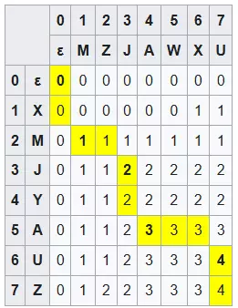
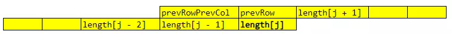

There's a long-standing debate: *"Is grinding **algorithms** only for **coding interviews** and not really useful in real work?"* Of course, there are obvious examples like **ride-hailing apps**, which must use **pathfinding algorithms**—a classic algorithm we learned in college. But writing such important algorithms seems to be the job of a **small number of senior developers**, while most of us do simpler tasks, not knowing when we'll get to use the knowledge we've worked so hard to acquire. Are we **wasting a lot of time**?

So today's article will share a problem I encountered in a project, and how practicing **LeetCode** helped me solve it. I'm not bragging—this is just a small algorithm, nothing world-changing. I just want to show that: *"Oh, so grinding algorithms can sometimes be applied to real projects!"* 😜

# The Problem

I'm building an English speaking app called [**Speakie**](https://speakie.xyz/), mainly to solve my own pain point: I can't speak full sentences in conversation, often pausing to think about grammar. So the lessons in the app are based on **common conversational sentence patterns**.

> Quick ad break:
>
> Android: https://play.google.com/store/apps/details?id=com.areser.speakie
>
> iOS: https://apps.apple.com/app/speakie/id6593695505

The problem: when a user says a sentence, I need to compare it to the sample sentence, coloring **correct words green** and **incorrect words red**. And I want to color as many words green as possible to encourage the user.

> Example:
>
> **Sample sentence:** Hello World! Welcome to my app Speakie.
>
> **User's sentence:** Hello Henry! Welcome to my world.
>
> ==> The sample sentence should have "Hello", "Welcome", "to", "my" colored green.

A naive solution is to use a `Set` to store the user's words, then check each word in the sample—if it's in the set, color it green, otherwise red. But this doesn't preserve word order. For example, if "world" appears out of order, this method would still color it green.

While working, I noticed some popular English learning apps still make this mistake—you can test by intentionally saying words out of order 😉

# LeetCode problem

Thinking of a solution, I immediately remembered the [Longest Common Subsequence](https://leetcode.com/problems/longest-common-subsequence) problem. The problem:

> Given two strings `text1` and `text2`, return the length of their longest common subsequence. If there is no common subsequence, return 0.
>
> A subsequence of a string is a new string formed from the original by deleting some (or no) characters without changing the order of the remaining characters.
>
> For example, "ace" is a subsequence of "abcde".

## Base solution

This problem requires **Dynamic Programming**. For example, with `text1` = "**XMJYAUZ**", `text2` = "**MZJAWXU**", we create a 2D array to store the length of the longest common subsequence as we iterate:



You can understand:

* Row 0: `text1` is empty, `text2` = "MZJAWXU", no subsequence => **0**
* Row 1: `text1` = "X", `text2` = "MZJAWXU", subsequence = "**X**" => **1**
* Row 2: `text1` = "XM", `text2` = "MZJAWXU", subsequence = "**X**" or "**M**" => **1**
* Row 3: `text1` = "XMJ", `text2` = "MZJAWXU", subsequence = "**MJ**" => **2**
* ...

In general, for character `i` of `text1` and `j` of `text2`:

* If `text1[i]` == `text2[j]`, then `length[i][j]` = `length[i - 1][j - 1]` + 1
* If `text1[i]` != `text2[j]`, then `length[i][j]` = max(`length[i - 1][j]`, `length[i][j - 1]`)

Full source code:

```java
public int longestCommonSubsequence(String text1, String text2) {
    int n1 = text1.length(), n2 = text2.length();
    int[][] length = new int[n1 + 1][n2 + 1];
    for (int i = 1; i <= n1; ++i) {
        for (int j = 1; j <= n2; ++j) {
            if (text1.charAt(i - 1) == text2.charAt(j - 1)) {
                length[i][j] = length[i - 1][j - 1] + 1;
            } else {
                length[i][j] = Math.max(length[i - 1][j], length[i][j - 1]);
            }
        }
    }
    return length[n1][n2];
}
```

## Space Optimization solution

The above is the most understandable and matches our analysis. However, there's a more memory-efficient way—see [Solutions](https://leetcode.com/problems/longest-common-subsequence/solutions/351689/java-python-3-two-dp-codes-of-o-mn-o-min-m-n-spaces-w-picture-and-analysis/).

When iterating row `i`, we only need values from row `i - 1` and the value of `length[i][j - 1]`. So instead of a 2D array, we just need 1 array and two variables `prevRowCol`, `prevRow`:



```java
public int longestCommonSubsequence(String text1, String text2) {
    int n1 = text1.length(), n2 = text2.length();
    if (n1 < n2) {
        return longestCommonSubsequence(text2, text1);
    }
    int[] length = new int[n2 + 1];
    for (int i = 1; i <= n1; ++i) {
        for (int j = 1, prevRow = 0, prevRowCol = 0; j <= n2; ++j) {
            prevRowCol = prevRow;
            prevRow = length[j];
            if (text1.charAt(i - 1) == text2.charAt(j - 1)) {
                length[j] = prevRowCol + 1;
            } else {
                length[j] = Math.max(length[j - 1], prevRow);
            }
        }
    }
    return length[n2];
}
```

# Applying to the problem

See the connection to our original problem? We just **replace characters with words** to find the **common words** in the sample and user sentences. However, the LeetCode problem only gives the **length of the subsequence**, while we want to know **which words** are in the subsequence to color them.

## Boolean array

My first thought was to use a `Boolean array` with the length of the sample sentence, marking `true` for words that appear and `false` for those that don't. But the problem is, at each step when considering `length[i][j] = max(length[i - 1][j], length[i][j - 1])`, we need the **Boolean arrays of both `[i - 1][j]` and `[i][j - 1]`** to set the **Boolean array for `[i][j]`** according to the larger `length`. This means we need another array similar to `length`, but each element is a `Boolean array`—a 2D Boolean array.

```java
// For simplicity, sample (the sample sentence) and input (the user's sentence) have been
// converted from sentences to lists of words, all lowercase, no accents...
public void displaySampleSentence(String[] sample, String[] input) {
    int sampleLength = sample.length, inputLength = input.length;
    int[] length = new int[inputLength + 1];
    boolean[][] match = new boolean[inputLength + 1][sampleLength + 1];
    boolean[] prevRowMatch = new boolean[sampleLength + 1];
    boolean[] prevRowColMatch = new boolean[sampleLength + 1];
    
    for (int i = 1; i <= sampleLength; ++i) {
        for (int j = 1, prevRow = 0, prevRowCol = 0; j <= inputLength; ++j) {
            prevRowCol = prevRow;
            prevRow = length[j];
            prevRowColMatch = prevRowMatch;
            prevRowMatch = match[j];
            if (sample[i - 1].equals(input[j - 1])) {
                length[j] = prevRowCol + 1;
                match[j] = prevRowColMatch;
                match[j][i] = true;
            } else if (length[j - 1] >= prevRow) {
                length[j] = length[j - 1];
                match[j] = match[j - 1];
            }
        }
    }
    for (int i = 1; i <= sampleLength; ++i) {
        if (match[inputLength][i]) {
            // Display sample[i - 1] as green word
        } else {
            // Display sample[i - 1] as red word
        }
    }
}
```

## Integer and Bit manipulation

To make it simpler and lighter, I thought of using an `int` instead of a `Boolean array`, and using **bitwise operations**—set bit = 1 for `true`, bit = 0 for `false`. On Android and iOS, Dart's `int` uses 64 bits. If each bit represents a word, we can store up to 64 words—more than enough for my app.

A quick reminder about bitwise operations. To set the i-th bit to `true`, use OR and SHIFT LEFT:

```java
match |= 1 << i;

// Example: match = 1, i = 3
match  = 0001
1 << i = 1000
match | (1 << i) = 1001 // => match = 9
// So we've set the 3rd bit from the right (0th index) to 1 (TRUE)
```

To get the value of the i-th bit, use SHIFT RIGHT and AND:

```java
int value = (match >> i) & 1;

// Example: match = 25, i = 3
match      = 0001 1001
match >> i = 0000 0011
(match >> i) & 1 = 1
// So the value of the 3rd bit from the right (0th index) is 1 (TRUE)
```

Applying this to the above solution, we have:

```java
public void displaySampleSentence(String[] sample, String[] input) {
    int sampleLength = sample.length, inputLength = input.length;
    int[] length = new int[inputLength + 1];
    int[] match = new int[inputLength + 1];
    int prevRowMatch = 0, prevRowColMatch = 0;
    
    for (int i = 1; i <= sampleLength; ++i) {
        for (int j = 1, prevRow = 0, prevRowCol = 0; j <= inputLength; ++j) {
            prevRowCol = prevRow;
            prevRow = length[j];
            prevRowColMatch = prevRowMatch;
            prevRowMatch = match[j];
            if (sample[i - 1].equals(input[j - 1])) {
                length[j] = prevRowCol + 1;
                match[j] = prevRowColMatch;
                match[j][i] = true;
            } else if (length[j - 1] >= prevRow) {
                length[j] = length[j - 1];
                match[j] = match[j - 1];
            }
        }
    }
    for (int i = 1; i <= sampleLength; ++i) {
        if (match[inputLength][i]) {
            // Display sample[i - 1] as green word
        } else {
            // Display sample[i - 1] as red word
        }
    }
}
```

# Lời kết

**Algorithms** are still a foundational element in this programming field. Over time, technologies may become outdated or rise in popularity, but algorithms remain, standing the test of time.

Through this interesting example, I hope you'll be more excited about learning algorithms and applying them to real-world problems.

# Reference

* https://leetcode.com/problems/longest-common-subsequence
* https://wikipedia.org/wiki/Longest_common_subsequence
* https://dart.dev/guides/language/numbers
