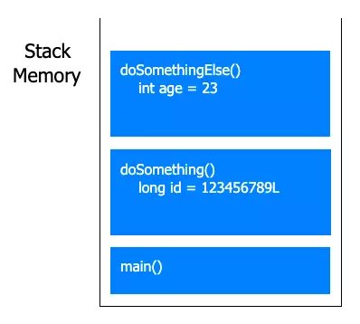
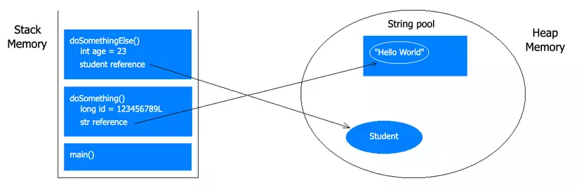

# What are Stack and Heap Memory?

Memory management is an important factor in programming. Knowing how to optimize memory will help our applications run smoothly, without lag or crashes. The JVM (Java Virtual Machine) divides memory into two parts: **Stack** and **Heap** (do not confuse these with the Stack and Heap data structures). In this article, we will learn about the roles, functions, and how each type of memory works.

# Stack Memory

## How it works

**Stack** stores variables of **primitive types** (int, float, char, boolean...), **local variables**, and **information about called methods**. It operates on a **LIFO** (**L**ast **I**n **F**irst **O**ut) mechanism. This means that methods called last are allocated a frame in the Stack, containing information about parameters, local variables, and the Stack will release that frame when the method returns.

For example, with the following code:

```java
public static void main(String[] args) {
    doSomething();
}

private static void doSomething() {
    long id = 123456789L;
    doSomethingElse();
}

private static void doSomethingElse() {
    int age = 23;
}
```

The Stack will store information in the following structure:



The Stack is used to execute a thread, so the JVM will create a **separate stack for each thread**. By default, if we do not specify the Stack size, the JVM will create it with a size depending on the **operating system and computer architecture** (usually **1MB**). However, we can use the `-Xss` flag to customize the Stack size (not exceeding the max size, usually 1GB).

```
java -Xss1048576 // 1,048,576 bytes
java -Xss1024k // 1,024 KB
java -Xss1m // 1 MB
```

## StackOverflow

A classic error related to the Stack is **StackOverflow**. It occurs when the amount of data stored in the Stack exceeds its limit.

For example, when we call recursion without a stopping condition:

```java
void callRecursion() {
    callRecursion();
}
```

You can imagine methods continuously being loaded into the Stack, and at some point, it will exceed the small 1MB size. Therefore, the above code will throw a `java.lang.StackOverflowError`.

Some ways to avoid StackOverflow error:

* Ensure recursive functions have a stopping condition or are not called too many times
* Manage threads carefully
* Avoid using large local variables
* Avoid circular dependencies

# Heap Memory

## How it works

**Heap** stores variables of **Object** or **array** data types. It uses a mechanism of **dynamic memory allocation and deallocation**. Heap is quite flexible, able to expand or shrink as needed during program execution.

For example, when we use the `new` keyword to create a `Student` object:

```java
private static void doSomething() {
    long id = 123456789L;
    Student student = new Student();
    doSomethingElse();
}

private static void doSomethingElse() {
    int age = 23;
    String str = "Hello World";
}
```

Memory will find a random empty region in the Heap to allocate and store the information of the `student` object. On the Stack side, there will be a **reference variable** pointing to the information of the `student` object in the Heap. For Strings, Heap has a special data structure called the String pool to store them.



Heap is created when the JVM starts and is used as long as the application is running. Unlike Stack, Heap is shared among all threads.

By default, the initial size of the Heap is **256MB** and the maximum size is **4068MB**. We can also change these parameters using the `-Xms` (initial size) and `-Xmx` (maximum size) flags.

```
// Initial heap size = 512MB, Maximum heap size = 1024MB
java -Xms512m -Xmx1024m
```

## Garbage Collection

In Java, **Garbage Collection** is responsible for reclaiming memory from variables in the Heap that are **no longer referenced**. This process is performed automatically. In the example above, when we no longer use the `student` object, Garbage Collection will automatically reclaim the memory previously allocated for it.

Thanks to this mechanism, Heap allows allocation and deallocation of memory for variables with large sizes and complex structures at runtime. If we create too many variables in the Heap but poor code prevents Garbage Collection from reclaiming memory efficiently, it will cause a **memory leak**.

> **Garbage Collection** works like a manager in a restaurant. When customers arrive, staff will invite them to an empty table, bring out bowls, chopsticks, and menus (allocate memory). The manager will regularly walk around to check, and if they see a table where customers have finished and left, they will call staff to clean up and prepare for new customers (free memory).

## OutOfMemory

When the Heap is full and we cannot allocate memory for a new object, it will throw a `java.lang.OutOfMemoryError`.

Our solution is to analyze the code, use profiling tools to detect where memory leaks occur, remove references to objects when they are no longer needed, and let Garbage Collection do its job. Some ways to optimize memory:

* Avoid creating unnecessary objects
* Reuse objects if possible
* Choose appropriate data structures
* Prefer using local variables over global variables

# Comparison

|                   | Stack Memory                       | Heap Memory                         |
|-------------------|------------------------------------|-------------------------------------|
| Storage           | primitive, local variables, method | Object, array                       |
| Access speed      | Fast                               | Slow                                |
| Size              | Small, Fixed                       | Large, Dynamic                      |
| Usage scope       | Thread corresponding to Stack      | All threads                         |
| Allocation order  | LIFO                               | Random                              |
| Variable lifetime | From method call to return         | From creation to Garbage Collection |

# Conclusion

In this article, there are still many concepts related to memory that I have not been able to convey. I hope you have a basic understanding of how Stack and Heap memory work, so you can gain more experience in optimizing your application's performance.
