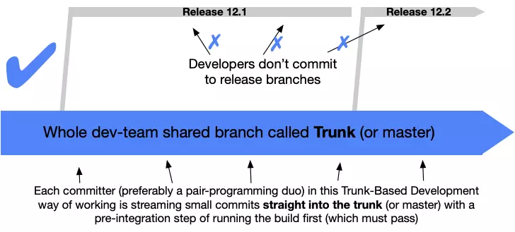
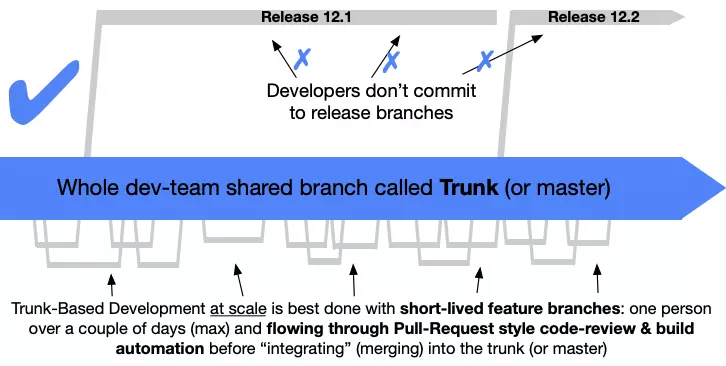

# Case study

## The first story

At my previous company (let's call it company A), the project source code was huge—just cloning it was 40GB, and after compiling and building, it reached nearly 100GB. Every time someone coded a feature, they would usually checkout a new branch like feature_x. For small features, it was fine, but for big features that changed dozens or even hundreds of files, merging into the main branch was a nightmare because you had to resolve conflicts from other feature branches that had been merged earlier.

## The second story

At another company (company B), due to the nature of the project, it was split into 5 small teams, each with about 3 developers. Each team was responsible for a few features in a sprint. At the start of the sprint, the dev lead would create a branch for each team, and after the sprint, all 5 branches would be merged. The same problem occurred: merging code resulted in a lot of conflicts, and teams had to spend time retesting their features to ensure no bugs appeared after merging.

# So what is Trunk Based Development?

In short, **Trunk Based Development** (from now on, **TBD**) is a **source-control branching model** where all developers work on **a single branch** called the **trunk** (like the trunk of a tree), avoiding the creation of huge feature branches. The **trunk** branch must always be ready for release at any time. In projects, people usually name the trunk branch **master** or **dev**.

TBD is divided into two smaller models, suitable for different team sizes. Let's explore them.

## TBD for small teams



In this model, the whole dev team pushes code directly to the trunk branch. However, this model carries a big risk for code quality, since code is pushed directly without review. To use this model, devs must have strong technical skills to ensure every line they push doesn't introduce bugs for the team.

Personally, I think this model is only suitable for teams of 5 or fewer.

## TBD for large teams



With TBD for a large team, feature branches are still created, but the difference is they only exist for a short time—just a few commits before merging back to the trunk branch.

For example, when assigned to code the Onboarding feature, with the usual Git flow, you might:

1. Create a **feature/onboarding** branch
2. Code the Welcome screen and commit
3. Code the Register screen and commit
4. Code the Login screen and commit
5. After finishing, create a merge request and wait for review
6. After review, merge **feature/onboarding** into **dev**

With this process, a merge request can contain dozens of changed files, and reviewing that much code is a nightmare. Sometimes, when you create the merge request, there are conflicts with another feature that was merged into **dev** earlier, and you have to spend time resolving conflicts.


For reviewers, sometimes the only way out of the nightmare is to stop dreaming—meaning the senior dev quickly leaves a short comment **LGTM** (Look good to me), and the junior dev easily merges code into **dev**. Or, even if the senior dev tries to review carefully, with so many changes, some bugs still slip through. In short, this process still risks letting bugs through.

With TBD, the process is adjusted a bit:

1. Create **feature/welcome_screen** branch
2. Code the Welcome screen, commit, and create a merge request immediately
3. While waiting for review, code the Register screen
4. When the Welcome screen merge request is approved, checkout **feature/register_screen** and create a new merge request
5. Do the same for the Login screen

Now, each merge request only contains a few changed files, making it much easier for the senior dev to review.

And even if the release branch has a bug and needs a hotfix, devs don't merge directly into the release branch as in other models—everything must be merged into the trunk branch.

## Feature flag

You might wonder: doesn't this mean the **dev** branch will be full of unfinished feature code? For example, the app will show the new Welcome screen UI, while Register and Login screens still have the old UI. So how can you ensure the trunk branch is always ready for release?

The key is the **Feature flag**. For each unfinished feature, you add a flag so that when it's on, all the new feature code is active, and when it's off, the app works as before. For example:

```java
if (ONBOARDING_FLAG == FLAG_ON) {
    displayNewWelcomeScreen()
} else {
    displayOldWelcomeScreen()
}

if (ONBOARDING_FLAG == FLAG_ON) {
    displayNewRegisterScreen()
} else {
    displayOldRegisterScreen()
}

if (ONBOARDING_FLAG == FLAG_ON) {
    displayNewLoginScreen()
} else {
    displayOldLoginScreen()
}
```

Sometimes, if you want to revert a feature, just turn off its flag. Quick and easy, right?

# Advantages

## Fewer conflicts, less code review time

As mentioned above, TBD requires everyone to quickly merge their code into the trunk branch, which helps reduce conflicts and code review time.

In company B's case study, after seeing the current model wasn't effective, I suggested the dev lead try TBD. As expected, in each sprint, our team hardly had to spend time resolving conflicts anymore.

## CI/CD

TBD is very useful for CI/CD. Now you only need to set up and run CI/CD on a single branch. Every commit is quickly checked for coding conventions and unit tests, making it easy for the team to spot and fix errors in time.

## A/B Testing

With feature flags, it's easy to turn features on and off, making it convenient for Product Managers to set up A/B Testing. This helps measure and accurately evaluate the effectiveness of new features.

In company A's first case study, we actually applied feature flags to many important features for A/B testing.

## Fast product delivery

Since the code in the trunk branch is always ready for release, I think it's quite suitable for startups. Whenever you want to release a new version, just checkout from the trunk branch, turn on the completed feature flags, turn off the unfinished ones, and build.

# Disadvantages

## Too much leftover code

On the flip side, using **feature flags** and too many if-else statements can make your code more complex. Sometimes, unclear if-else logic can make it even harder for reviewers to understand.

And when a feature is released, you have to go back and remove the old code flow, like the `displayOldWelcomeScreen`, `displayOldRegisterScreen`, and `displayOldLoginScreen` functions in the example above.

## Not suitable for teams with many juniors

Constantly creating merge requests requires devs to be careful, ensuring every commit passes all coding convention checks and unit tests locally, and especially that there are no critical bugs. If a bug on the trunk branch prevents the app from opening, it blocks everyone else.

If using feature flags, devs also need to test both the old and new flows to ensure both work correctly.

So I think a team mostly made up of seniors is more suitable for this model.

# Conclusion

TBD is a workflow I've applied at several companies and found it quite effective for my team's situation. You can consider the pros and cons and try it with your team.

# Reference

* https://trunkbaseddevelopment.com/
