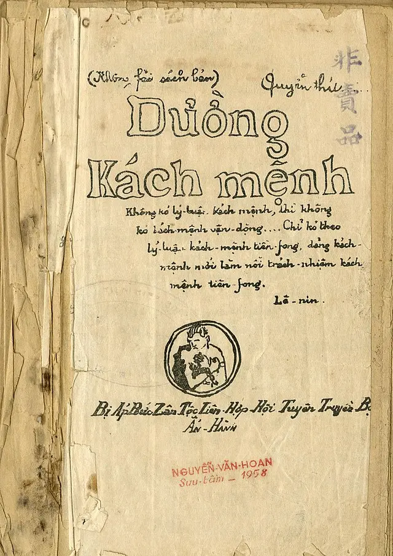
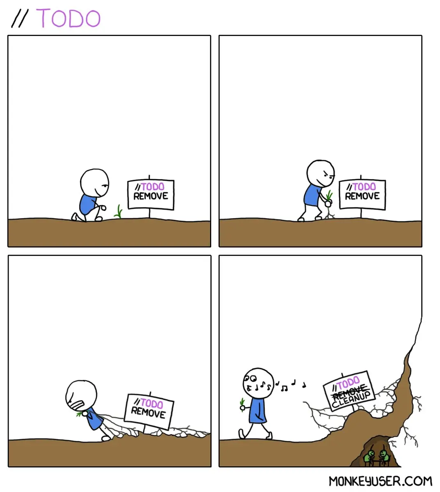

# Chữ Quốc ngữ vốn chứa đựng nhiều lỗi

Trước hết để mọi người không nhầm lẫn thì cần phân biệt rõ ràng 2 khái niệm **tiếng Việt** và **chữ Quốc ngữ**. [**Tiếng Việt**](https://vi.wikipedia.org/wiki/Ti%E1%BA%BFng_Vi%E1%BB%87t) là ngôn ngữ của người Việt và đã xuất hiện từ **khoảng đầu Công nguyên**, là cách mà cha ông ta nói chuyện, giao tiếp với nhau, gọi tên sự vật, hiện tượng như `trời`, `đất`, `bánh chưng`, `bánh dày`... Còn [**chữ Quốc ngữ**](https://vi.wikipedia.org/wiki/Ch%E1%BB%AF_Qu%E1%BB%91c_ng%E1%BB%AF) là một loại chữ viết dựa trên **chữ cái Latinh**, được sáng tạo bởi các **tu sĩ Bồ Đào Nha** dùng để ghi âm tiếng Việt vào **đầu thế kỷ XVII**.

Mình không có vấn đề gì với **tiếng Việt**, nhưng **chữ Quốc ngữ** thì mình thấy nó còn chứa đựng nhiều lỗi. Ví dụ như hồi đi học, có bao giờ bạn thắc mắc:

- Tại sao tên một số địa danh như `Đắk Lắk`, `Đắk Nông` lại có cách viết khác với các từ thông thường?
- Tại sao chữ `c`, `g`, `ng` lại không thể đứng trước `e`, `ê`, `i`, mà chúng ta phải dùng `k`, `gh`, `ngh`?
- Tại sao Bác Hồ lại viết là `Đường Kách mệnh` chứ không phải là `Đường Cách mạng` như ngày nay chúng ta hay viết?

Chữ Quốc ngữ vay mượn chủ yếu từ tiếng **Bồ Đào Nha** và tiếng **Ý**, ví dụ như trong tiếng Bồ Đào Nha, nếu để chữ `c` đứng trước `a`,`o`,`u` sẽ biểu thị phụ âm `/k/`, nhưng khi đứng trước `e`,`i` sẽ biểu thị phụ âm `/s/`. Vì vậy để tránh cho những người biết tiếng biết Bồ Đào Nha khỏi đọc sai, các tu sĩ mới đặt ra quy tắc phải dùng `k` thay cho `c` khi đứng trước `e`,`ê`,`i`,`y`.

Còn với người Việt Nam, chúng ta không bị hiểu nhầm như trên, nên chúng ta có thể hoàn toàn dùng `c` thay cho `k` trong mọi từ mà không bị phát âm sai. Ví dụ như nếu mình viết là `con ciến` thay cho `con kiến`, `cái cem` thay cho `cái kem`, mặc dù là viết sai chính tả, nhưng người Việt vẫn có thể đọc đúng, chứ không đọc thành `con siến` hay `cái sem` như người Bồ Đào Nha.

Như trong tiêu đề của bài viết này, mình dùng từ `kải kách` thay cho `cải cách` nhưng các bạn vẫn hiểu ý mình đang truyền đạt đúng không?

# Những công trình không bao giờ được triển khai

Nhận thấy sự bất hợp lý này, đã có rất nhiều công trình đề xuất cải tiến chữ Quốc ngữ. Trong đó có thể kể đến dự thảo **Phương án cải tiến chữ Quốc ngữ bước đầu** của **Giáo sư Hoàng Phê** xây dựng từ những năm **1960-1961**. Trong đó, ông đề xuất một số điểm như:

- Bỏ `h` trong `gh` và `ngh`. Ví dụ: ghê -> gê, nghe -> nge, nghiêng -> ngiêng.
- Dùng `f` thay `ph`, `d` thay `đ`, `z` thay `d` và `gi`. Ví dụ: dân tộc -> zân tộc, đất nước -> dất nước, phương pháp -> fương fáp.
- Nhất luật viết phụ âm `/k/` bằng `k` trong mọi trường hợp, thay cho `c`, và nghiên cứu thay cả cho `q`. Ví dụ như `Đường kách mệnh`.

Hoặc một trường hợp nổi tiếng khác là đề xuất **Phương án cải tiến chữ Quốc ngữ** của **Phó giáo sư Bùi Hiền**. Ông từng công bố đề xuất ở Báo Giáo dục và Thời đại số 72 ngày **8/9/1995**. Cuối năm 2017, sau một cuộc hội thảo thì đề xuất của ông được đưa ra truyền thông và đã có bàn cãi sôi nổi do những khác lạ trong lối viết cải tiến mà ông đưa ra. Ở thời điểm đó, khi mà người người nhà nhà chê trách PGS Bùi Hiền, có lẽ mình là một trong số ít những người thấy được một số điểm hợp lý trong đề xuất của ông (chỉ một số thôi chứ không phải toàn bộ phương án).

Nhưng qua năm tháng, các bạn có thể thấy những công trình trên sẽ **không bao giờ được triển khai**, bởi vì nó sẽ gây tốn kém rất lớn về **thời gian**, **tiền bạc** và **nguồn lực** của cả xã hội. Hãy thử tưởng tượng cả nước phải đi đổi Căn cước công dân, Sổ hộ khẩu, giấy tờ hành chính, các bộ gõ tiếng Việt phải cập nhật lại quy tắc, các phần mềm phải cập nhật lại giao diện... Mình nghĩ nó phải tốn cả chục năm để hoàn thành mất.

# Những nguyên lý trong lập trình

Câu chuyện trên nghe qua thì có vẻ như chẳng liên quan đến ngành **Công nghệ thông tin**, nhưng các bạn hãy thử xoay góc nhìn, coi **chữ Quốc ngữ** như một **ngôn ngữ lập trình** với bộ quy tắc riêng về cách đặt phụ âm, cách kết nối các âm, cách đánh dấu thanh... Qua đó, chúng ta sẽ có một số góc nhìn mới về sự ra đời và phát triển của **chữ Quốc ngữ** và liên hệ nó với các nguyên lý, bài học trong ngành lập trình.

## Code luôn có đầy rẫy edge case

Có thể thấy, tên một số địa danh như `Đắk Lắk`, `Đắk Nông` chính là một edge case của chữ Quốc ngữ. Trong lập trình cũng vậy, chúng ta luôn phải lưu ý xử lý edge case để **tránh chương trình gặp lỗi** sau này.

Ví dụ như thực hiện phép chia thì luôn phải kiểm tra trường hợp **số chia khác 0**, tìm phần tử đầu tiên của mảng thì luôn phải kiểm tra trường hợp **mảng bị rỗng**.

Ví dụ bạn có một input text field thì cần suy nghĩ các edge case như user không nhập gì, user nhập text quá dài hoặc user nhập sai format mà chúng ta mong muốn. Việc check edge case trong trường hợp này còn giúp chúng ta tránh được cuộc tấn công **Cross Site Scripting (XSS)**.

## Tính tương thích ngược (Backward Compatible)

Thực ra chữ Quốc ngữ vẫn đang có những **sự cải tiến** từ lúc ra đời đến ngày nay. Ví dụ như ngày xưa Bác Hồ viết `Đường Kách mệnh` nhưng ngày nay chúng ta lại viết là `Đường Cách mạng`. Hoặc trước đây, các từ ghép hoặc tên riêng thường có dấu gạch nối ở giữa, ví dụ như `độc-lập`, `tự-do`, `Việt-Nam`, `Luân-Đôn`... Thế nhưng ngày nay, những dấu gạch nối đó đã bị bỏ đi. Những sự cải tiến nhỏ này vẫn đảm bảo mọi người có thể hiểu được cách viết mới dễ dàng, không cần tốn quá nhiều thời gian để làm quen.

Trong các ngôn ngữ lập trình, khi có nâng cấp một version mới, thường nó sẽ luôn được đảm bảo **tính tương thích ngược** để những chương trình viết theo cách viết code cũ **không bị xảy ra lỗi**. Ví dụ như các function cũ có thể bị đánh dấu là `Deprecated`, hiển thị warning cho các lập trình viên biết rằng function này sẽ sớm bị thay thế, nhưng không bị xoá ngay để chúng ta có thời gian update nó.

## Code đang chạy ổn thì đừng đụng vào

Việc đề xuất cải cách của PGS Bùi Hiền bị dư luận phản ứng dữ dội một phần vì nó **khác quá xa** với những gì mà mọi người đang đọc, đang viết hàng ngày. Nếu được áp dụng vào thực tế, chắc chắn trong quá trình thực thi sẽ có những sự **xung đột** giữa những văn bản, phần mềm được viết bằng **kiểu chữ cũ** và **kiểu chữ cải cách**.

Nó giống như câu chuyện kinh điển trong ngày lập trình mà anh em thường nói vui với nhau *"Code đang chạy ổn thì đừng đụng vào"*. Hồi mới ra trường, mình từng nhiệt tình xung phong refactor một feature có flow khá phức tạp. Thế rồi hậu quả là mình mất một mớ thời gian để đi fix bug cho những corner case của feature đó mà khi bắt đầu làm mình chưa lường trước hết được.

## Phát hiện lỗi càng muộn, chi phí sửa đổi càng lớn

Như mình chia sẻ ở trên, những công trình cải cách chữ Quốc ngữ trên có thể sẽ không bao giờ được đưa vào đời sống bởi vì sự tốn kém của nó. Nếu muốn sửa, có lẽ thời điểm tốt nhất là lúc... các tu sỹ Bồ Đào Nha **mới sáng tạo ra** nó.

Cùng là một bug, nếu bạn phát hiện ra nó ở phase **develop**, bạn chỉ cần **sửa vài dòng code** là xong. Nếu nó đã được **release lên beta**, việc chỉnh sửa có thể sẽ ảnh hưởng đến **một nhóm nhỏ user**. Còn nếu xui hơn là sản phẩm đã được **release lên production** tới toàn bộ user, **một thay đổi nhỏ** có thể **gây ảnh hưởng cực lớn**, ví dụ như làm mất dữ liệu của user hoặc gây ra trải nghiệm tệ trong quá trình sử dụng phần mềm.

Bạn có nhớ đến trường hợp lỗi pin của điện thoại Galaxy Note 7 không? Sự cố này đã khiến Samsung phải thu hồi dòng điện thoại này, gây thiệt hại cho hãng 5,4 tỷ USD.

# Kết luận

Bài viết này chỉ đưa ra một góc nhìn thú vị về lập trình và cuộc sống, không nhằm mục đích công kích tổ chức hay cá nhân nào. Hy vọng bạn coi nó như một bài viết mang tính giải trí trong lúc trà dư tửu hậu.
